VinhKhanhAudioGuide
-------------------

PRD v1.0 — Full System Documentation

Tổng Quan

[Giới Thiệu](#overview) [Kiến Trúc Hệ Thống](#arch) [Class Diagram](#class) [ER Diagram](#er)

Mobile App

[Pages & MVVM](#mobile) [Audio Playback](#audio) [Geolocation](#geo)

Web Backend

[Mobile API Endpoints](#api) [TTS Service (Edge + Google)](#tts) [Cloudinary Storage](#cloudinary) [Auth & RBAC](#auth) [POI Change Request](#approval)

Web Admin

[SystemAdmin Pages](#admin) [PoiAdmin (Shop) Portal](#shop)

Diagrams

[State Diagrams](#state) [Sequence Diagrams](#seq) [Activity Diagrams](#act)

Tổng Kết

[Tech Stack](#stack) [Roadmap](#roadmap)

PRD v1.0 — April 2026

VinhKhanhAudioGuide  
Hệ Thống Hướng Dẫn Âm Thanh
=================================================

Full-stack enterprise: .NET MAUI (MVVM + DI) — ASP.NET Core 8 Razor Pages + Minimal API — SQL Server + EF Core — Cloudinary CDN — Edge TTS + Google TTS fallback — POI Change Request Workflow — Role-based RBAC (SystemAdmin / PoiAdmin).

.NET MAUI 8 (MVVM)ASP.NET Core 8 Razor PagesEF Core + SQL ServerCloudinary CDNEdge TTS NeuralCookie Auth + RBACPOI Change RequestsPlugin.Maui.Audio

17

Mobile Pages

15

ViewModels

13+

API Endpoints

12

DB Tables

6

TTS Languages

2

Admin Roles

Chapter 00

Giới Thiệu Sản Phẩm
-------------------

**VinhKhanhAudioGuide** (AudioLife) là hệ thống hướng dẫn âm thanh du lịch ẩm thực đường phố Vĩnh Khánh, Q4, TP.HCM. Kiến trúc enterprise với **MVVM pattern** trên mobile, **Razor Pages** trên web, **EF Core + SQL Server**, lưu trữ audio trên **Cloudinary CDN**, và TTS tự động bằng **Edge Neural Voices** với Google TTS fallback. Hệ thống có **2 portal riêng biệt**: SystemAdmin (quản lý toàn bộ) và PoiAdmin/Shop (chủ quán quản lý địa điểm của mình).

### Mục Tiêu

*   Audio guide tự động cho du khách khi đến gần địa điểm (geolocation 100m)
*   TTS đa ngôn ngữ: vi, en, zh, ja, ko, fr (Edge Neural + Google fallback)
*   Cloudinary CDN lưu trữ audio MP3 chuyên nghiệp
*   MVVM + Dependency Injection trên mobile
*   POI Change Request: PoiAdmin gửi yêu cầu -> SystemAdmin duyệt
*   Offline support: SQLite local database + audio download

### 2 Roles Quản Trị

*   **SystemAdmin:** Full access — CRUD Locations, Categories, Tours, AudioGuides, Users, Reports, Settings, Change Requests
*   **PoiAdmin (Shop):** Quản lý địa điểm được gán — sửa Location, tạo/sửa AudioGuide, gửi Change Request, xem Analytics, Reviews

### Tính Năng Nổi Bật

*   Plugin.Maui.Audio — audio player chuyên nghiệp (play/pause/seek/volume)
*   AudioScriptSegment — hiển thị transcript đồng bộ theo thời gian phát
*   Cloudinary upload + f\_mp3 on-the-fly transformation
*   Edge TTS với 6 Neural voices + Google TTS fallback khi 403
*   QR code scanning cho AppUser identification
*   Feedback/Rating system (1-5 stars) per location
*   Download audio offline với SQLite tracking

Chapter 01

Kiến Trúc Hệ Thống
------------------

System Architecture — Component Diagram

```mermaid
graph TB subgraph "Mobile — .NET MAUI (MVVM + DI)" M\_VIEWS\["Views (17 pages)  
XAML + Code-behind"\] M\_VM\["ViewModels (15)  
CommunityToolkit.Mvvm"\] M\_SVC\["Services  
ApiService, AudioService  
GeolocationService"\] M\_DB\["SQLite  
mobile\_local.db3"\] M\_NAV\["NavigationService  
Shell routing"\] end subgraph "Web — ASP.NET Core 8" W\_RAZOR\["Razor Pages  
Admin + Shop portals"\] W\_API\["Minimal API  
/api/mobile/\*"\] W\_SVC\["Services  
TTS, Cloudinary  
ChangeRequest, Auth"\] W\_EF\["EF Core  
AppDbContext"\] end subgraph "Infrastructure" SQLSRV\[(SQL Server  
AudioDB)\] CLOUD\["Cloudinary CDN  
Audio MP3 storage"\] EDGE\["Edge TTS  
Neural Voices"\] GTTS\["Google TTS  
Fallback"\] end M\_VIEWS --> M\_VM M\_VM --> M\_SVC M\_SVC --> M\_DB M\_SVC -->|HTTP| W\_API W\_RAZOR --> W\_SVC W\_RAZOR --> W\_EF W\_API --> W\_EF W\_SVC --> CLOUD W\_SVC --> EDGE W\_SVC -.->|fallback| GTTS W\_EF --> SQLSRV style M\_VIEWS fill:#1565C0,color:#fff style W\_RAZOR fill:#7c3aed,color:#fff style W\_API fill:#16a34a,color:#fff style CLOUD fill:#e65100,color:#fff style EDGE fill:#00838f,color:#fff
```

**Kiến trúc:** Mobile dùng MVVM + DI (CommunityToolkit.Mvvm). Web dùng Razor Pages + Minimal API. Database: SQL Server + EF Core (code-first migrations). Audio storage: Cloudinary CDN với on-the-fly MP3 transformation. TTS: Edge Neural Voices (vi, en, zh, ja, ko, fr) với Google TTS fallback khi Edge trả về 403.

Class Diagram
-------------


Domain Model — Class Diagram

```mermaid
classDiagram class Location { +string Id +string Name +string Description +string ImageUrl +string Address +double Latitude +double Longitude +int Duration +string CategoryId +ICollection AudioGuides +ICollection TourLocations +ICollection Feedbacks } class AudioGuide { +string Id +string Title +string Description +string AudioUrl +string CloudinaryAudioUrl +string CloudinaryPublicId +string TranscriptText +int Duration +string LocationId +string Language +bool GeneratedFromTts +string TtsSourceText +ICollection ScriptSegments +ICollection ListeningHistories } class AudioScriptSegment { +int Id +string AudioGuideId +int StartTimeSeconds +int EndTimeSeconds +string ScriptText } class Category { +string Id +string Name +string Icon +string Description +ICollection Locations } class Tour { +string Id +string Name +string Description +string ImageUrl +int Duration +decimal Price +bool IsFeatured +ICollection TourLocations } class TourLocation { +string TourId +string LocationId +int SortOrder } class AppUser { +string Id +string ScannedQrCode +DateTime CreatedAt +bool IsActive } class Feedback { +int Id +string UserId +string LocationId +int Rating +string Comment +DateTime CreatedAt } class ListeningHistory { +int Id +string UserId +string AudioGuideId +int ListenedSeconds +bool IsCompleted +DateTime LastListenedAt } class AuthUserAccount { +int Id +string Username +string Password +string DisplayName +string Role +bool IsActive } class PoiChangeRequest { +Guid Id +string SubmittedByUsername +string LocationId +string Topic +string Title +string Details +PoiChangeTargetType TargetType +string TargetEntityId +string ChangeSetJson +PoiChangeRequestStatus Status +string ReviewNote } class PoiAdminLocationAssignment { +int Id +string Username +string LocationId } Location "1" --> "\*" AudioGuide : has Location "1" --> "\*" Feedback : receives AudioGuide "1" --> "\*" AudioScriptSegment : has segments AudioGuide "1" --> "\*" ListeningHistory : tracked Category "1" --> "\*" Location : contains Tour "\*" --> "\*" Location : via TourLocation AppUser "1" --> "\*" ListeningHistory : listens AppUser "1" --> "\*" Feedback : writes AuthUserAccount "1" --> "\*" PoiChangeRequest : submits PoiAdminLocationAssignment "\*" --> "1" Location : assigned
```

ER Diagram — SQL Server
-----------------------


Database ER Diagram — 12 Tables

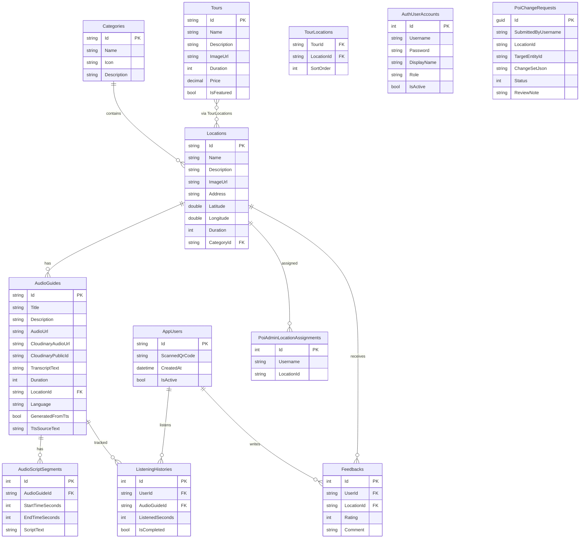

Chapter 02

Mobile App — 17 Pages, MVVM Pattern
-----------------------------------

Kiến trúc **MVVM + Dependency Injection** với CommunityToolkit.Mvvm. Tất cả ViewModels dùng `[ObservableProperty]`, `[RelayCommand]`. Services được inject qua constructor. Navigation qua Shell routing.

### IntroPage

Onboarding giới thiệu app. Chuyển đến MainPage sau khi hoàn thành.

### MainPage

Trang chủ — danh sách locations, categories, featured tours. Search bar.

### MapPage

Bản đồ tương tác hiển thị locations. Geolocation tracking 100m radius.

### LocationDetailPage

Chi tiết địa điểm — hình ảnh, mô tả, audio guides, feedbacks. Favorite toggle.

### AudioPlayerPage

Player chuyên nghiệp: play/pause/seek/volume. Transcript hiển thị đồng bộ theo AudioScriptSegment.

### ToursPage + TourDetailPage

Danh sách tours + chi tiết tour với locations theo thứ tự SortOrder.

### SearchPage

Tìm kiếm locations theo tên, mô tả, địa chỉ.

### FavoritesPage

Danh sách địa điểm yêu thích (SQLite local).

### HistoryPage

Lịch sử nghe audio — ListeningHistory với listened seconds, completion.

### DownloadsPage

Audio đã tải về offline. Quản lý dung lượng. Xóa downloads.

### ProfilePage + EditProfilePage

Hồ sơ người dùng. Chỉnh sửa thông tin.

### SettingsPage + LanguageSection

Cài đặt app. Chọn ngôn ngữ (vi/en/zh/ja/ko/fr).

### HelpPage + AboutPage

Hướng dẫn sử dụng và thông tin ứng dụng.

Chapter 03

Audio Playback — Plugin.Maui.Audio
----------------------------------

AudioService dùng **Plugin.Maui.Audio** (IAudioManager) để phát MP3. Hỗ trợ play/pause/resume/stop/seek/volume. Position timer cập nhật mỗi 500ms. AudioScriptSegment hiển thị transcript đồng bộ theo thời gian.

Load URL/File→ IAudioPlayer.Play()→ Position Timer 500ms→ Transcript Sync→ PlaybackEnded

**Audio States:** None → Loading → Playing → Paused → Stopped → Completed → Error. Event-driven: StateChanged + PositionChanged callbacks.

Chapter 04

Geolocation — Nearby Detection
------------------------------

GeolocationService theo dõi vị trí mỗi 60 giây. Khi phát hiện location trong bán kính 100m (Haversine), phát sự kiện `NearbyLocationDetected`. Chỉ trigger 1 lần cho mỗi location (theo dõi `_lastNearestLocationId`).

### Tracking Config

*   Radius: 100m (0.1 km)
*   Interval: 60 seconds
*   Accuracy: GeolocationAccuracy.Medium
*   Timeout: 10 seconds per request

### Haversine Formula

Earth radius 6,371 km. Tính khoảng cách chính xác giữa 2 tọa độ GPS. Kết quả trả về km.

Chapter 05

Mobile API — Minimal API Endpoints
----------------------------------

Endpoint

Method

Mô Tả

`/api/mobile/health`

GET

Health check

`/api/mobile/categories`

GET

Tất cả categories + location count

`/api/mobile/locations`

GET

Tất cả locations + audio guides

`/api/mobile/locations/{id}`

GET

Chi tiết location + audio guides

`/api/mobile/locations/by-category/{categoryId}`

GET

Locations theo category

`/api/mobile/locations/search?query=`

GET

Tìm kiếm (Name, Description, Address)

`/api/mobile/locations/nearby?lat=&lng=&radiusKm=`

GET

Nearby (Haversine, default 100m)

`/api/mobile/tours`

GET

Tất cả tours + location IDs

`/api/mobile/tours/{id}`

GET

Chi tiết tour

`/api/mobile/tours/featured`

GET

Tours nổi bật (IsFeatured=true)

`/api/mobile/audio/by-location/{locationId}`

GET

Audio guides + script segments theo location

`/api/mobile/audio/{id}`

GET

Chi tiết audio guide + segments

Chapter 06

TTS Service — Edge Neural + Google Fallback
-------------------------------------------

`EdgeTextToSpeechService` dùng thư viện **EdgeTTS** (NuGet) để tạo audio MP3 từ text. 6 Neural voices. Khi Edge trả về 403, tự động fallback sang Google Translate TTS (free). Text dài được split thành chunks 180 ký tự, merge MP3 và strip ID3 headers.

Language

Edge Voice

Google Code

vi - Tiếng Việt

vi-VN-HoaiMyNeural

vi

en - English

en-US-JennyNeural

en

zh - Trung

zh-CN-XiaoxiaoNeural

zh-CN

ja - Nhật

ja-JP-NanamiNeural

ja

ko - Hàn

ko-KR-SunHiNeural

ko

fr - Pháp

fr-FR-DeniseNeural

fr

Text input→ Edge TTS Neural→ MP3 bytes→ Cloudinary upload→ CDN URL saved

**Fallback:** Edge 403 → Google Translate TTS (split text 180 chars, merge MP3 chunks, strip ID3 headers). Log error + retry.

Chapter 07

Cloudinary Audio Storage
------------------------

`CloudinaryAudioStorageService` upload audio lên Cloudinary CDN. Dùng `VideoUploadParams` (Cloudinary coi audio là video). URL cuối cùng được transform: `/video/upload/` → `/video/upload/f_mp3/` để on-the-fly convert sang MP3. Mỗi file có unique PublicId.

### Upload Flow

*   IFormFile hoặc Stream → Cloudinary API
*   Folder: `audio/`
*   PublicId: `{prefix}-{GUID}`
*   URL transform: f\_mp3 on-the-fly

### Stored Fields

*   `AudioUrl` — URL cuối cùng (f\_mp3)
*   `CloudinaryAudioUrl` — URL gốc Cloudinary
*   `CloudinaryPublicId` — ID để manage/delete

Chapter 08

Authentication & RBAC
---------------------

Cookie Authentication với `CookieAuthenticationDefaults`. 2 roles: **SystemAdmin** và **PoiAdmin**. Auth source: `appsettings.json` (config users) + `AuthUserAccounts` table (DB users). PoiAdmin được gán location qua `PoiAdminLocationAssignments`. Authorization policies: `SystemAdminOnly`, `PoiAdminOnly`.

Role

Access

Folders

**SystemAdmin**

Full access: Admin, Categories, Locations, Tours, AudioGuides

/Admin/\*, /Categories/\*, /Locations/\*, /Tours/\*, /AudioGuides/\*

**PoiAdmin**

Địa điểm được gán: sửa Location, tạo/sửa AudioGuide, gửi ChangeRequest

/Shop/\*

**PoiAdmin Assignment:** Mỗi PoiAdmin được gán một số LocationIds. UserAccessService kiểm tra `CanAccessLocation()` trước mỗi thao tác. SystemAdmin có thể chuyển/gán lại locations giữa các PoiAdmin.

Chapter 09

POI Change Request Workflow
---------------------------

`PoiChangeRequestService` quản lý quy trình: PoiAdmin gửi yêu cầu thay đổi (Location hoặc AudioGuide) → SystemAdmin duyệt (Approved/Rejected). Khi Approved, hệ thống tự động `TryApplyChangeSetAsync()` — parse ChangeSetJson và apply từng field vào entity.

PoiAdmin→ Submit Request→ Pending→ SystemAdmin Review→ Approved→ Auto Apply ChangeSet

### TargetType

*   `Location` — sửa Name, Description, Address, ImageUrl, Lat/Lng, Duration
*   `AudioGuide` — sửa Title, Description, AudioUrl, Cloudinary fields, Language, Transcript. Hỗ trợ `create-audio-guide` action.

### Status Flow

*   `Pending` → `InReview` → `Approved` / `Rejected`
*   ChangeSetJson lưu JSON diff của các fields thay đổi
*   ReviewNote: ghi chú của admin khi duyệt/từ chối

Chapter 10

SystemAdmin — Razor Pages
-------------------------

### Admin/Index

Dashboard tổng quan: stats, recent activities.

### Admin/Users

CRUD AuthUserAccounts. Gán role, assign locations cho PoiAdmin.

### Admin/ChangeRequests

Duyệt/từ chối POI Change Requests. Xem diff ChangeSetJson.

### Admin/Reports

Báo cáo thống kê: listening, feedback, locations.

### Admin/Settings

Cấu hình hệ thống.

### Locations/\*

CRUD Locations + MapView (bản đồ tổng quan).

### Categories/\*

CRUD Categories (Quán ăn, WC, Bãi xe...).

### Tours/\*

CRUD Tours + gán TourLocations với SortOrder.

### AudioGuides/\*

CRUD AudioGuides + TTS generation + Cloudinary upload.

Chapter 11

PoiAdmin (Shop) Portal
----------------------

### Shop/Index

Dashboard của PoiAdmin — chỉ hiện locations được gán.

### Shop/Locations/Edit

Sửa thông tin location (chỉ những địa điểm được assign).

### Shop/AudioGuides/\*

CRUD audio guides cho locations của mình. TTS generate + Cloudinary upload.

### Shop/ChangeRequests

Gửi yêu cầu thay đổi. Xem trạng thái pending/approved/rejected.

### Shop/Analytics

Thống kê nghe audio cho locations của mình.

### Shop/Reviews

Xem feedback/reviews của du khách cho locations.

State Diagrams
--------------

Audio Playback — State Machine

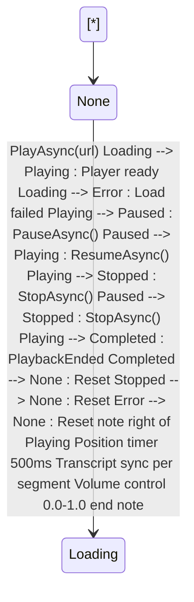

POI Change Request — State Machine

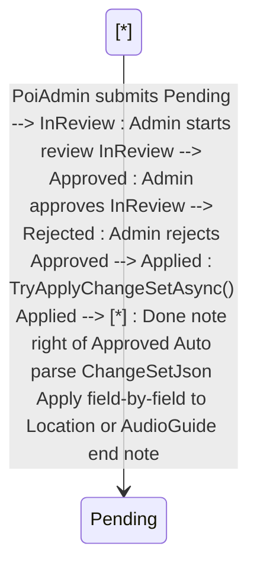

TTS Generation — State Machine

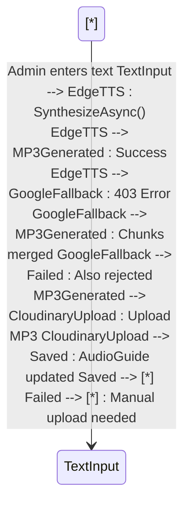

Geolocation Tracking — State Machine

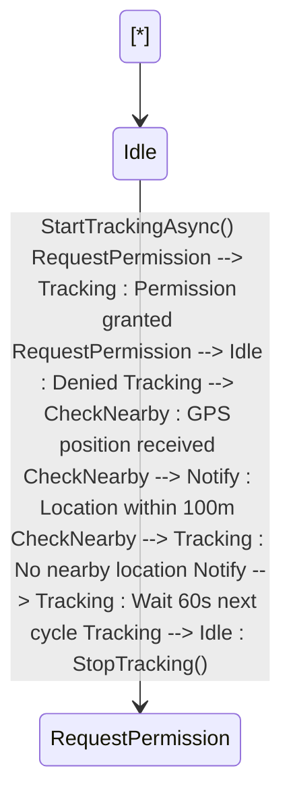

<details>
<summary><strong>Sequence Diagrams (nhan de mo)</strong></summary>

Sequence Diagrams
-----------------

Audio Playback Flow

```mermaid
sequenceDiagram participant U as User participant VP as AudioPlayerPage participant VM as AudioPlayerVM participant SVC as AudioService participant PLG as Plugin.Maui.Audio participant API as Web API U->>VP: Tap Play on AudioGuide VP->>VM: PlayCommand.Execute() VM->>API: GET /api/mobile/audio/{id} API-->>VM: AudioGuide + ScriptSegments VM->>SVC: PlayAsync(audioUrl) SVC->>SVC: LoadPlayerAsync (HTTP download) SVC->>PLG: CreatePlayer(stream) PLG-->>SVC: IAudioPlayer SVC->>PLG: player.Play() SVC->>SVC: StartPositionTimer (500ms) loop Every 500ms SVC->>SVC: Update CurrentPosition SVC-->>VM: PositionChanged event VM->>VM: Sync transcript segment VM-->>VP: UI update end PLG-->>SVC: PlaybackEnded SVC-->>VM: StateChanged(Completed) VM->>VM: Save ListeningHistory
```

Geolocation Nearby Detection

```mermaid
sequenceDiagram participant GEO as GeolocationService participant GPS as Device GPS participant API as ApiService participant APP as MapViewModel GEO->>GPS: GetLocationAsync (accuracy: Medium) GPS-->>GEO: {Latitude, Longitude} GEO->>API: GetNearbyLocationsAsync(lat, lng, 0.1km) API-->>GEO: Nearby locations list alt Location found within 100m GEO->>GEO: Check \_lastNearestLocationId alt New location (not same as last) GEO-->>APP: NearbyLocationDetected event GEO->>GEO: \_lastNearestLocationId = newId APP->>APP: Show notification / auto-play end end Note over GEO: Wait 60 seconds GEO->>GPS: Next tracking cycle
```

TTS Generation + Cloudinary Upload

```mermaid
sequenceDiagram participant A as Admin participant WEB as Razor Page participant TTS as EdgeTTSService participant EDGE as Edge Neural API participant GTTS as Google TTS participant CLD as Cloudinary participant DB as SQL Server A->>WEB: Enter TTS text + select language WEB->>TTS: SynthesizeAsync(text, "vi") TTS->>TTS: GetVoiceForLanguage("vi") = HoaiMyNeural TTS->>EDGE: Communicate(text, voice) alt Edge Success EDGE-->>TTS: MP3 bytes (stream) else Edge 403 Error TTS->>GTTS: SynthesizeWithGoogleFallbackAsync() GTTS->>GTTS: SplitTextForGoogleTts(180 chars) loop Each chunk GTTS->>GTTS: GET translate.google.com/translate\_tts GTTS->>GTTS: StripId3Header + merge end GTTS-->>TTS: Merged MP3 bytes end WEB->>CLD: UploadAudioAsync(mp3Stream) CLD->>CLD: Upload as video + f\_mp3 transform CLD-->>WEB: {AudioUrl, CloudinaryPublicId} WEB->>DB: UPDATE AudioGuides SET AudioUrl, GeneratedFromTts=true WEB-->>A: Success notification
```

POI Change Request — Submit + Review

```mermaid
sequenceDiagram participant POI as PoiAdmin participant SHOP as Shop Pages participant SVC as ChangeRequestService participant DB as SQL Server participant ADM as SystemAdmin participant ADMIN as Admin Pages POI->>SHOP: Edit location / audio guide SHOP->>SHOP: Build ChangeSetJson (field diffs) SHOP->>SVC: SubmitAsync(PoiChangeRequest) SVC->>DB: INSERT PoiChangeRequests (status=Pending) SVC-->>SHOP: Request submitted SHOP-->>POI: "Chờ admin duyệt" ADM->>ADMIN: Open ChangeRequests page ADMIN->>SVC: GetAllAsync() SVC->>DB: SELECT \* ORDER BY SubmittedAtUtc DESC DB-->>ADMIN: List requests ADM->>ADMIN: Approve request ADMIN->>SVC: TryUpdateStatusAsync(id, Approved, "admin") SVC->>SVC: TryApplyChangeSetAsync() alt TargetType = Location SVC->>DB: UPDATE Locations SET field=value... else TargetType = AudioGuide alt Action = create-audio-guide SVC->>DB: INSERT AudioGuides else Update existing SVC->>DB: UPDATE AudioGuides SET field=value... end end SVC->>DB: UPDATE PoiChangeRequests SET Status=Approved SVC-->>ADMIN: "Đã duyệt và áp dụng!"
```

User Login + Authorization

```mermaid
sequenceDiagram participant U as User participant LP as Login Page participant AUTH as AuthUserStore participant CFG as appsettings.json participant DB as SQL Server participant CK as Cookie U->>LP: Enter username + password LP->>AUTH: FindByCredentialsAsync(user, pass) AUTH->>CFG: Check configured users list alt Found in config CFG-->>AUTH: AuthUserOption (role, locationIds) else Not in config AUTH->>DB: SELECT FROM AuthUserAccounts WHERE Username AND Password alt Found in DB DB-->>AUTH: AuthUserAccount AUTH->>DB: SELECT LocationIds FROM PoiAdminLocationAssignments DB-->>AUTH: Assigned locationIds else Not found AUTH-->>LP: null (login failed) LP-->>U: "Sai tài khoản" end end AUTH-->>LP: AuthUserOption LP->>CK: SignIn (Claims: role, username, owned\_locations) CK-->>U: Redirect to Admin or Shop based on role
```

SystemAdmin — CRUD Location + AudioGuide

```mermaid
sequenceDiagram participant A as SystemAdmin participant WEB as Razor Pages participant EF as EF Core participant DB as SQL Server participant TTS as EdgeTTSService participant CLD as Cloudinary A->>WEB: Create new Location WEB->>EF: db.Locations.Add(location) EF->>DB: INSERT INTO Locations DB-->>WEB: Success A->>WEB: Create AudioGuide for location A->>WEB: Option 1: Upload audio file WEB->>CLD: UploadAudioAsync(file) CLD-->>WEB: {AudioUrl, CloudinaryPublicId} WEB->>EF: db.AudioGuides.Add(guide) EF->>DB: INSERT INTO AudioGuides A->>WEB: Option 2: Generate from TTS WEB->>TTS: SynthesizeAsync(text, language) TTS-->>WEB: MP3 bytes WEB->>CLD: UploadAudioAsync(mp3Stream) CLD-->>WEB: {AudioUrl, CloudinaryPublicId} WEB->>EF: Update AudioGuide (GeneratedFromTts=true) EF->>DB: UPDATE AudioGuides
```

</details>

<details>
<summary><strong>Activity Diagrams (nhan de mo)</strong></summary>

Activity Diagrams
-----------------

Audio Guide Creation — Full Pipeline

```mermaid
flowchart TD A(\[Admin opens AudioGuide Create\]) --> B{Upload or TTS?} B -->|Upload file| C\[Validate file format\] C --> D\[CloudinaryAudioStorageService.Upload\] D --> E\[Transform URL: f\_mp3\] B -->|Generate TTS| F\[Enter text + select language\] F --> G\[EdgeTTSService.SynthesizeAsync\] G --> H{Edge success?} H -->|Yes| I\[MP3 bytes ready\] H -->|No 403| J\[Google TTS Fallback\] J --> K\[Split text 180 chars\] K --> L\[Merge chunks + strip ID3\] L --> I I --> D E --> M\[Save to DB: AudioUrl, CloudinaryPublicId\] M --> N{Add ScriptSegments?} N -->|Yes| O\[Add timestamp + text segments\] N -->|No| P(\[AudioGuide created\]) O --> P style A fill:#7c3aed,color:#fff style P fill:#16a34a,color:#fff
```

POI Change Request — Apply Logic

```mermaid
flowchart TD A(\[TryApplyChangeSetAsync\]) --> B\[Parse ChangeSetJson\] B --> C{TargetType?} C -->|Location| D\[Find Location by TargetEntityId\] D --> E{Location exists?} E -->|No| FAIL(\[Return false\]) E -->|Yes| F\[Apply field changes\] F --> G\[Name, Description, Address\] F --> H\[ImageUrl, Lat, Lng, Duration\] G --> OK(\[Return true\]) H --> OK C -->|AudioGuide| I{Action = create?} I -->|Yes| J\[Verify LocationId exists\] J --> K\[Create new AudioGuide\] K --> L\[Apply fields from ChangeSet\] L --> OK I -->|No| M\[Find existing AudioGuide\] M --> N{Exists and same LocationId?} N -->|No| FAIL N -->|Yes| O\[Apply field changes\] O --> P\[Title, Description, AudioUrl\] O --> Q\[Cloudinary fields, Language, TTS\] P --> OK Q --> OK style A fill:#7c3aed,color:#fff style OK fill:#16a34a,color:#fff style FAIL fill:#dc2626,color:#fff
```

Geolocation Nearby Detection Loop

```mermaid
flowchart TD A(\[StartTrackingAsync\]) --> B{Permission granted?} B -->|No| Z(\[Stop\]) B -->|Yes| C\[Set \_isTracking = true\] C --> D\[GetLocationAsync GPS\] D --> E{Got position?} E -->|No| F\[Wait 60s retry\] F --> D E -->|Yes| G\[CheckNearbyLocationsAsync\] G --> H\[GetNearbyLocationsAsync lat,lng,0.1km\] H --> I{Found nearby?} I -->|No| F I -->|Yes| J{Same as lastNearestId?} J -->|Yes| F J -->|No| K\[Fire NearbyLocationDetected\] K --> L\[Update \_lastNearestLocationId\] L --> F style A fill:#00838f,color:#fff style K fill:#1565C0,color:#fff style Z fill:#64748b,color:#fff
```

</details>

Summary

Tech Stack & Constants
----------------------

### Mobile

*   .NET MAUI 8 (MVVM)
*   CommunityToolkit.Mvvm
*   Plugin.Maui.Audio
*   SQLite-net (local DB)
*   Shell navigation

### Web Backend

*   ASP.NET Core 8 Razor Pages
*   Minimal API (/api/mobile/\*)
*   EF Core + SQL Server
*   Cookie Authentication
*   EdgeTTS (NuGet)
*   CloudinaryDotNet

### Infrastructure

*   SQL Server (AudioDB)
*   Cloudinary CDN (audio)
*   Edge Neural Voices (6 langs)
*   Google TTS (fallback)
*   Bootstrap 5 (admin UI)

Constant

Value

Location

Nearby Radius

100m (0.1 km)

GeolocationService.cs

Tracking Interval

60 seconds

GeolocationService.cs

Position Timer

500ms

AudioService.cs

Cookie Expiry

8 hours (sliding)

Program.cs

Database

AudioDB (SQL Server)

appsettings.json

Cloudinary Folder

audio/

appsettings.json

Google TTS chunk

180 chars max

EdgeTTSService.cs

Audio Transform

f\_mp3 (on-the-fly)

CloudinaryService.cs

SystemAdmin role

SystemAdmin

RoleNames.cs

PoiAdmin role

PoiAdmin

RoleNames.cs

Future

Roadmap
-------

### Security

*   JWT tokens thay Cookie cho mobile API
*   Password hashing (bcrypt/Argon2)
*   API rate limiting
*   HTTPS enforcement

### Features

*   Realtime listening analytics dashboard
*   Push notifications khi gán POI
*   Social sharing / QR code tours
*   Multi-language UI (mobile app)
*   Payment integration cho tours có phí

### Infrastructure

*   Docker containerization
*   CI/CD pipeline (GitHub Actions)
*   Azure deployment
*   CDN caching optimization

**Đã hoàn thành:** Full-stack enterprise với MVVM mobile (17 pages, 15 VMs), Razor Pages admin (2 portals), EF Core + SQL Server (12 tables), Cloudinary CDN, Edge TTS 6 languages + Google fallback, POI Change Request workflow, Role-based RBAC, AudioScriptSegment transcript sync, offline downloads, feedback/rating system.

**VinhKhanhAudioGuide (AudioLife)** — PRD v1.0

.NET MAUI (MVVM) + ASP.NET Core 8 Razor Pages + SQL Server + Cloudinary + Edge TTS