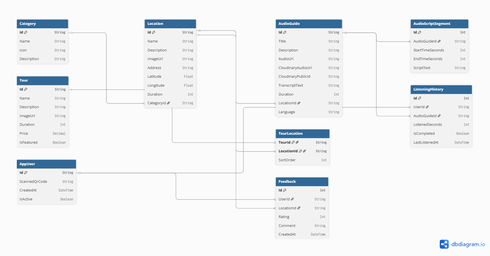

# PRD - Vinh Khanh Audio Guide

## 1. Thông tin tài liệu
- Product: Vinh Khanh Audio Guide
- Phạm vi: Mobile App + Web Admin
- Phiên bản: 2.0
- Ngày cập nhật: 2026-03-20
- Trạng thái: Draft for implementation
- Owner: Product/Engineering Team

## 2. Tổng quan sản phẩm
Vinh Khanh Audio Guide là hệ thống hướng dẫn khám phá ẩm thực đường phố, tập trung vào khu vực Vĩnh Khánh và các điểm đến liên quan tại TP.HCM.

Hệ thống gồm 2 thành phần:
- Mobile App (.NET MAUI): dành cho người dùng cuối để tìm địa điểm, xem tour, nghe audio guide, lưu yêu thích, theo dõi lịch sử, quản lý audio tải về.
- Web Admin (ASP.NET Core Razor Pages): dành cho vận hành nội dung và phân quyền theo 2 vai trò chính:
  - Admin
  - ShopOwner

## 3. Bài toán cần giải quyết
### 3.1 Vấn đề hiện tại
- Nội dung địa điểm ẩm thực và audio guide cần quản lý tập trung, đúng cấu trúc dữ liệu.
- Cần tách rõ quyền quản trị toàn hệ thống (Admin) và quyền theo cửa hàng (ShopOwner).
- Trải nghiệm mobile cần liền mạch từ tìm kiếm đến nghe audio, không rời rạc giữa các màn hình.

### 3.2 Cơ hội
- Tăng mức độ khám phá thực tế thông qua map, gợi ý tour và audio hướng dẫn.
- Nâng cao hiệu quả vận hành qua dashboard, CRUD theo module, báo cáo và analytics.
- Chuẩn hóa bộ dữ liệu để dễ dàng mở rộng sang nhiều cụm ẩm thực trong tương lai.

## 4. Mục tiêu sản phẩm
### 4.1 Mục tiêu kinh doanh
- Chuẩn hóa quy trình quản trị nội dung địa điểm, danh mục, tour và audio.
- Rút ngắn thời gian cập nhật nội dung từ admin đến app người dùng.
- Tăng tần suất sử dụng các chức năng search, map, audio player.

### 4.2 Mục tiêu người dùng
- Tìm được địa điểm phù hợp nhanh.
- Nghe audio giới thiệu ngắn gọn, rõ ràng.
- Theo dõi lộ trình tour để khám phá khu ẩm thực có định hướng.

### 4.3 KPI đề xuất
- Mobile:
  - Tỷ lệ người dùng mở audio ít nhất 1 lần mỗi session >= 45%
  - Tỷ lệ hoàn tất nghe > 70% độ dài audio >= 30%
  - Tỷ lệ người dùng sử dụng Search trước khi vào chi tiết địa điểm >= 40%
- Web Admin:
  - Thời gian tạo/cập nhật 1 audio guide <= 3 phút
  - Tỷ lệ location có ít nhất 1 audio guide >= 90%
  - Tỷ lệ dữ liệu đầy đủ metadata (tên, mô tả, duration, address, image, category) >= 95%

## 5. Personas
### 5.1 Khách khám phá ẩm thực
- Dùng mobile là chính.
- Muốn tìm quán ngon nhanh, xem vị trí và nghe giới thiệu.

### 5.2 Admin
- Quản trị toàn bộ dữ liệu, users, reports, settings.
- Chịu trách nhiệm chất lượng nội dung và vận hành hệ thống.

### 5.3 ShopOwner
- Quản lý thông tin cửa hàng được phân quyền.
- Cập nhật audio guide, theo dõi reviews và analytics của cửa hàng.

## 6. Phạm vi sản phẩm
### 6.1 In-scope
#### Mobile App (MAUI)
- Main/Home: địa điểm nổi bật, danh mục, gợi ý.
- Search: tìm kiếm địa điểm theo tên/mô tả/địa chỉ.
- Map: hiển thị vị trí địa điểm và khoảng cách.
- Tours: danh sách tour, chi tiết tour, các điểm trong tour.
- Audio Player: play/pause/seek, hiển thị progress.
- Profile: thông tin cá nhân, favorites, history, downloads, settings, edit profile.
- Favorites/History/Downloads/Help/About: các trang bổ trợ trải nghiệm đầy đủ.

#### Web Admin (ASP.NET Core Razor Pages)
- Account:
  - Login/Logout
  - AccessDenied
- Admin zone (role Admin):
  - Dashboard
  - Users
  - Categories CRUD
  - Locations CRUD
  - Tours CRUD
  - AudioGuides CRUD
  - Reports
  - Settings
- Shop zone (role Admin, ShopOwner):
  - Shop dashboard
  - Shop Locations
  - Shop AudioGuides
  - Reviews
  - Analytics

#### Data và backend
- SQL Server + EF Core cho dữ liệu nghiệp vụ.
- Cookie authentication + role policies:
  - AdminOnly
  - ShopAccess

### 6.2 Out-of-scope (giai đoạn hiện tại)
- Đặt chỗ/booking, thanh toán, loyalty points.
- Recommendation AI theo hành vi real-time.
- Multi-tenant đa thương hiệu.

## 7. Yêu cầu chức năng
### 7.1 Authentication và Authorization
- Người dùng chưa đăng nhập phải vào trang login.
- Đăng nhập đúng role:
  - Admin -> /Admin/Index
  - ShopOwner -> /Shop/Index
- Kiểm soát quyền truy cập bằng Razor Pages conventions + policy.

### 7.2 Quản trị Categories
- Tạo/sửa/xóa/xem category.
- Thuộc tính tối thiểu: Id, Name, Icon, Description.
- Chặn xóa nếu đang có location liên kết.

### 7.3 Quản trị Locations
- CRUD location.
- Thuộc tính tối thiểu: Id, Name, Description, Address, Latitude, Longitude, Duration, ImageUrl, CategoryId.
- Hiển thị số audio guides và thông tin liên quan.

### 7.4 Quản trị Tours
- CRUD tour.
- Cấu hình danh sách địa điểm trong tour.
- Thuộc tính: Id, Name, Description, Duration, Price, IsFeatured, ImageUrl.

### 7.5 Quản trị Audio Guides
- CRUD audio guide theo location.
- Thuộc tính: Id, Title, Description, AudioUrl, TranscriptText, Duration, LocationId, Language.
- Hỗ trợ Cloudinary URL/public id khi cần quản lý lưu trữ audio.

### 7.6 User và role management
- Xem danh sách users từ cấu hình xác thực.
- Quản lý role Admin/ShopOwner.
- Gán LocationIds cho ShopOwner để giới hạn phạm vi thao tác.

### 7.7 Reports và Analytics
- Dashboard tổng hợp số lượng categories/locations/tours/audio.
- Báo cáo theo location và theo role.
- ShopOwner có analytics theo các location được cấp quyền.

### 7.8 Mobile user experience
- Search theo tên/mô tả/địa chỉ.
- Nearby locations theo vị trí và bán kính.
- Audio player ổn định khi chuyển trang.
- Lưu lịch sử nghe và quản lý download offline.
- Toggle favorite và đồng bộ theo user profile.

## 8. Yêu cầu phi chức năng
### 8.1 Performance
- Search mobile trả kết quả trong <= 1 giây với tập dữ liệu hiện tại.
- Chuyển trang chính trong mobile (Main/Search/Map/Tours/Profile) mượt, không giật.
- Trang admin chính render trong <= 2 giây với dữ liệu mẫu.

### 8.2 Reliability
- Không crash khi dữ liệu rỗng.
- Các trang CRUD có empty state và validation message rõ ràng.
- Download/history/favorites xử lý an toàn khi item không tồn tại.

### 8.3 Security
- Cookie auth bắt buộc cho Web Admin.
- Không để lộ thông tin nhạy cảm trong appsettings production.
- Chỉ cho phép role đúng thao tác đúng folder được authorize.

### 8.4 Localization
- Content hướng người dùng cuối ưu tiên tiếng Việt.
- Thuật ngữ giao diện quản trị nhất quán: Admin, ShopOwner, Dashboard, Reports, Audio Guides.

### 8.5 Maintainability
- Mobile theo MVVM, tách ViewModels/Services rõ ràng.
- Web theo module pages và conventions để dễ mở rộng.
- ApiService mobile hiện tại dùng sample data phải giữ contract ổn định để dễ thay bằng HTTP backend.

## 9. Luồng nghiệp vụ chính
### 9.1 Luồng mobile
1. Mở app -> vào Main/Home.
2. Tìm địa điểm qua Search hoặc Map.
3. Mở Location Detail.
4. Phát audio guide tại Audio Player.
5. Lưu favorite, theo dõi history, hoặc download audio.

### 9.2 Luồng Admin
1. Login với role Admin.
2. Vào /Admin/Index.
3. Quản trị categories/locations/tours/audio guides.
4. Theo dõi reports, users, settings.

### 9.3 Luồng ShopOwner
1. Login với role ShopOwner.
2. Vào /Shop/Index.
3. Quản lý locations/audio guides thuộc phạm vi được cấp.
4. Xem reviews và analytics.

## 10. Data model mức cao
- Category (1) - (n) Location
- Location (1) - (n) AudioGuide
- Tour (n) - (n) Location qua TourLocation
- Location (1) - (n) Feedback
- User (Admin/ShopOwner) - (n) LocationIds
- AudioGuide (1) - (n) AudioScriptSegment
- AudioGuide (1) - (n) ListeningHistory

## 11. Kế hoạch phát hành đề xuất
### Phase 1 - Foundation
- Auth + role routing (Admin/ShopOwner).
- CRUD cơ bản Categories/Locations/Tours/AudioGuides.
- Mobile browse + audio playback cơ bản.

### Phase 2 - Operational quality
- Reports + settings + users management đầy đủ.
- Shop workflow: reviews + analytics + location scope.
- Hoàn thiện profile/favorites/history/downloads trên mobile.

### Phase 3 - Optimization
- Tối ưu search relevance và nearby ranking.
- Tích hợp backend API thật sự thay cho sample data trong mobile.
- Tối ưu UX audio player và map theo dữ liệu thực tế.

## 12. Rủi ro và giảm thiểu
- Rủi ro sai phạm vi ShopOwner:
  - Bắt buộc test role + LocationIds matrix.
- Rủi ro dữ liệu không đồng nhất giữa mobile và web:
  - Chuẩn hóa model contract và migration scripts.
- Rủi ro nợ UI do cập nhật rời rạc:
  - Dùng bộ style chung và review UI checklist trước release.
- Rủi ro sample data khác dữ liệu thật:
  - Lập kế hoạch thay thế ApiService local bằng HTTP API theo từng module.

## 13. Tiêu chí nghiệm thu (UAT)
- Login flow đúng với 2 role Admin/ShopOwner.
- Admin không bị chặn các module /Admin; ShopOwner không vào được module AdminOnly.
- CRUD chính (categories, locations, tours, audio guides) hoạt động ổn định.
- Mobile thực hiện được luồng tìm kiếm -> chi tiết địa điểm -> phát audio.
- Favorites/history/downloads cập nhật đúng dữ liệu.
- Build solution thành công cho cả Mobile và Web.

## 14. Phụ lục
### 14.1 Tech stack
- Mobile: .NET MAUI, MVVM, CommunityToolkit.Mvvm, MediaElement
- Web: ASP.NET Core Razor Pages (.NET 8)
- Data: SQL Server + EF Core
- Auth: Cookie Authentication + Role Policies

### 14.2 Tài liệu liên quan trong repo
- PRD_VinhKhanh_AudioGuide.md
- dbdiagram.dbml

### 14.3 Database diagram

