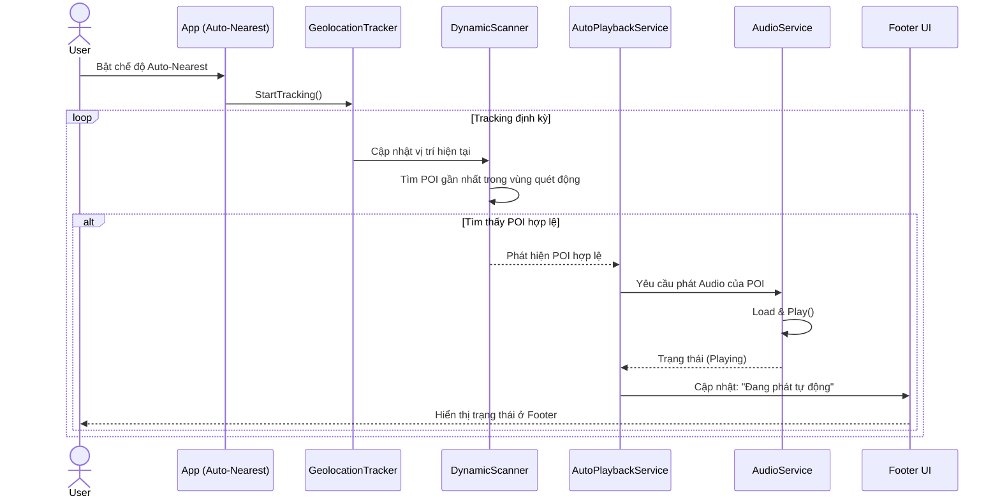
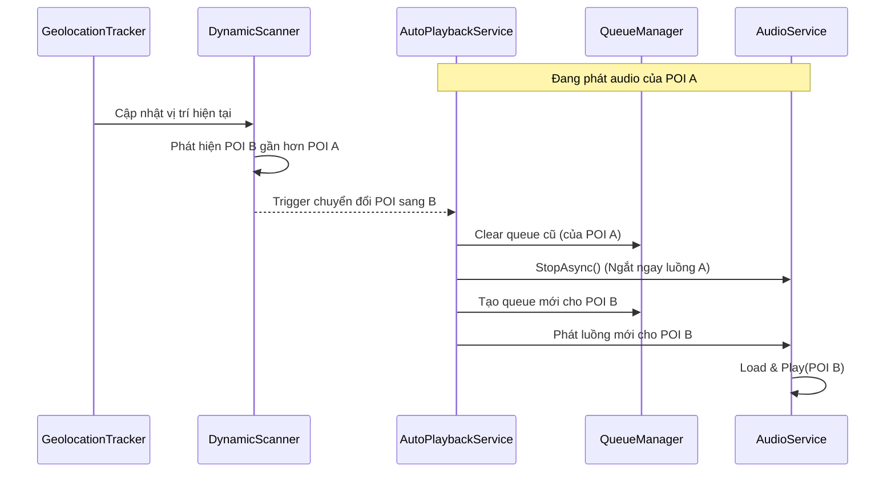
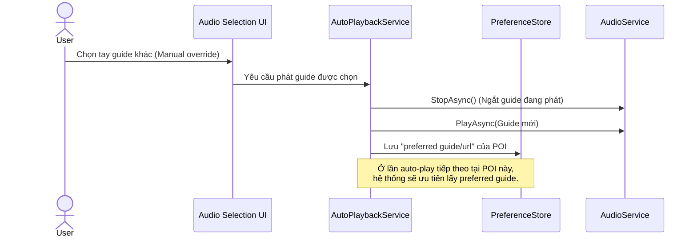
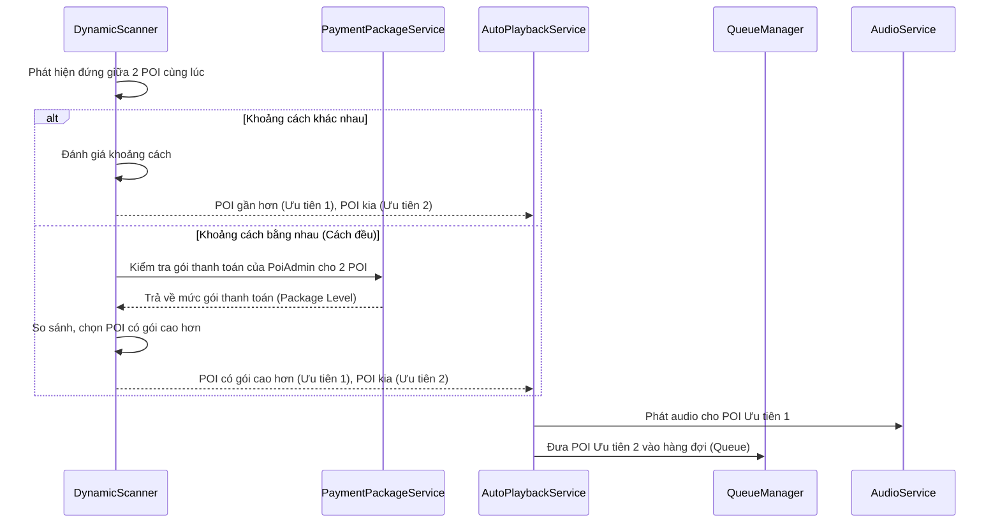
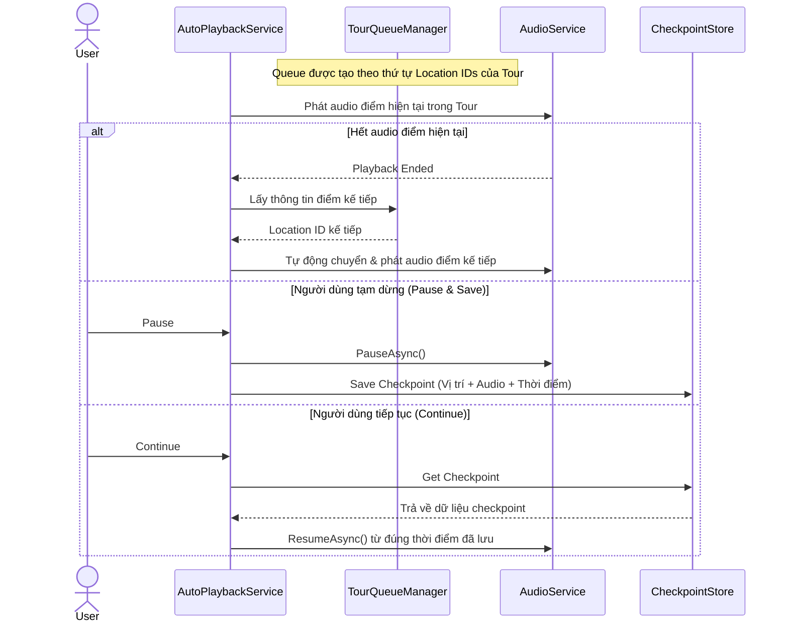

# Sequence Diagrams - Các Kịch Bản Auto-Playback

Dưới đây là sơ đồ tuần tự (Sequence Diagram) chi tiết cho 5 trường hợp theo đúng yêu cầu mô tả của dự án.

## TH1 — Tự động phát khi vào vùng POI

Khi bật chế độ auto-nearest, app bắt đầu tracking vị trí và tìm POI gần nhất trong vùng quét động. Nếu tìm thấy POI hợp lệ thì tự động phát audio của POI đó và cập nhật footer trạng thái “đang phát tự động”.

---

## TH2 — Đang nghe POI A, phát hiện POI B gần hơn

Hệ thống hiện tại ngắt luồng A khi chuyển POI: clear queue cũ, StopAsync(), rồi tạo queue mới cho B và phát B. Tức là không giữ A chạy đến hết rồi mới phát B.

---

## TH3 — Người dùng chọn tay audio khác

Nếu user bấm chọn guide khác, app restart ngay guide được chọn (manual override). Đồng thời lưu “preferred guide/url” để các lần auto sau tại cùng POI ưu tiên đúng lựa chọn user.

---

## TH4 - Đứng giữa 2 POI cùng lúc

Phát quán nào gần hơn trước, quán còn lại xếp hàng chờ. Nếu 2 quán cách đều nhau thì ưu tiên POI nào có PoiAdmin sử dụng gói thanh toán cao hơn thì phát trước.

---

## TH5 — Hàng đợi theo lộ trình Tour

Tour có queue theo thứ tự location IDs. Hết audio điểm hiện tại thì tự động chuyển sang điểm kế tiếp. Có Pause & Save checkpoint (vị trí + audio + thời điểm) và Continue để resume đúng vị trí đã lưu.

