# Sequence Diagrams — AudioLife (VinhKhanhAudioGuide)

> [!NOTE]
> Tài liệu cập nhật theo code mới nhất (04/2026). Bao gồm **11 sequence diagrams** cho toàn bộ chức năng chính, phản ánh các thay đổi: `AutoPlaybackService` (scoring system, queue, TH1-TH4), `GeolocationService` (tracking 5s, NearbyLocationCandidate), `ExpiredAccountCleanupService`, `PaymentPackageService` (CRUD + dashboard), và `AudioService` (PlayAsync với locationId/audioGuideId).

---

## 1. Khởi động App & Kiểm tra Session (Offline-first)

App hỗ trợ **offline-first**: nếu offline và có snapshot → vào app luôn. Nếu online → verify với server.

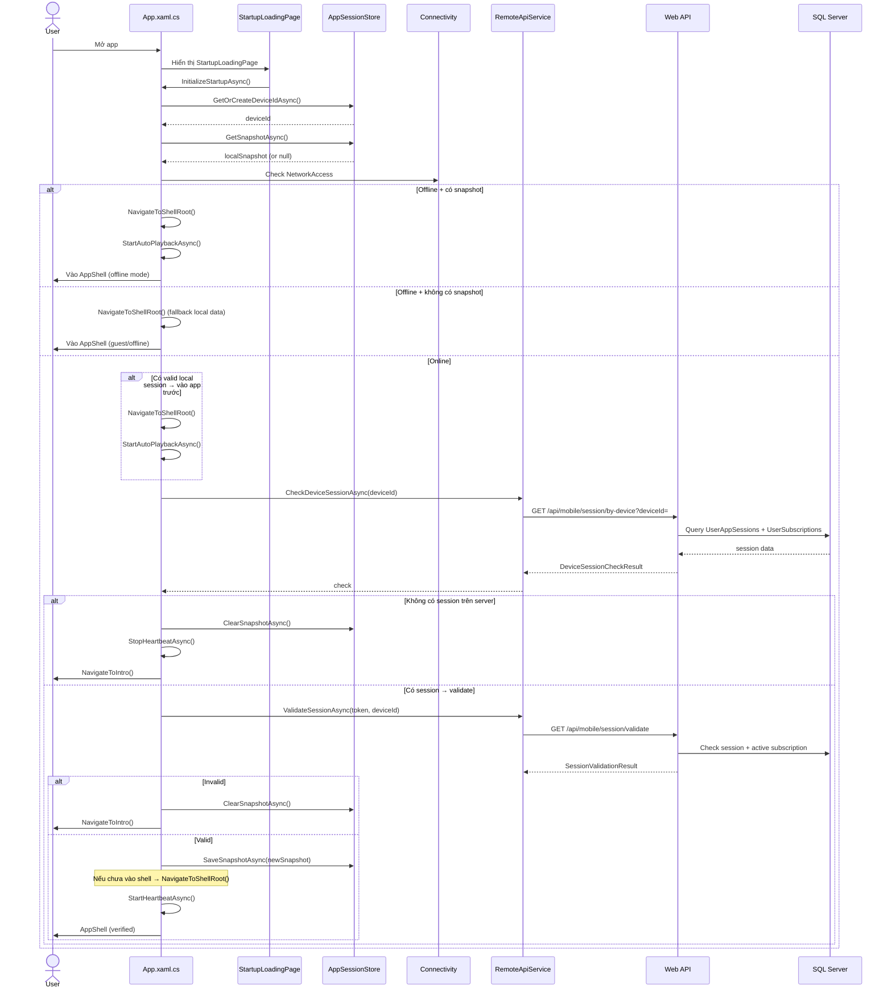

---

## 2. QR Onboarding → Payment → Language → App

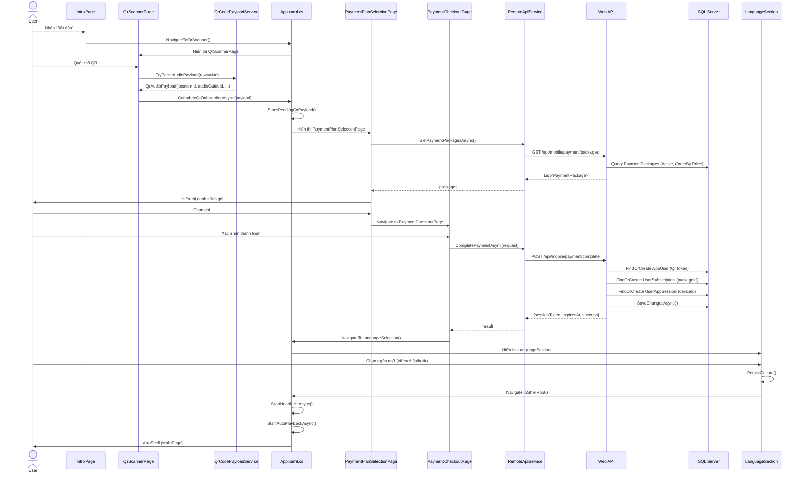

---

## 3. Duyệt & Tìm kiếm POI (với Cache + Localization)

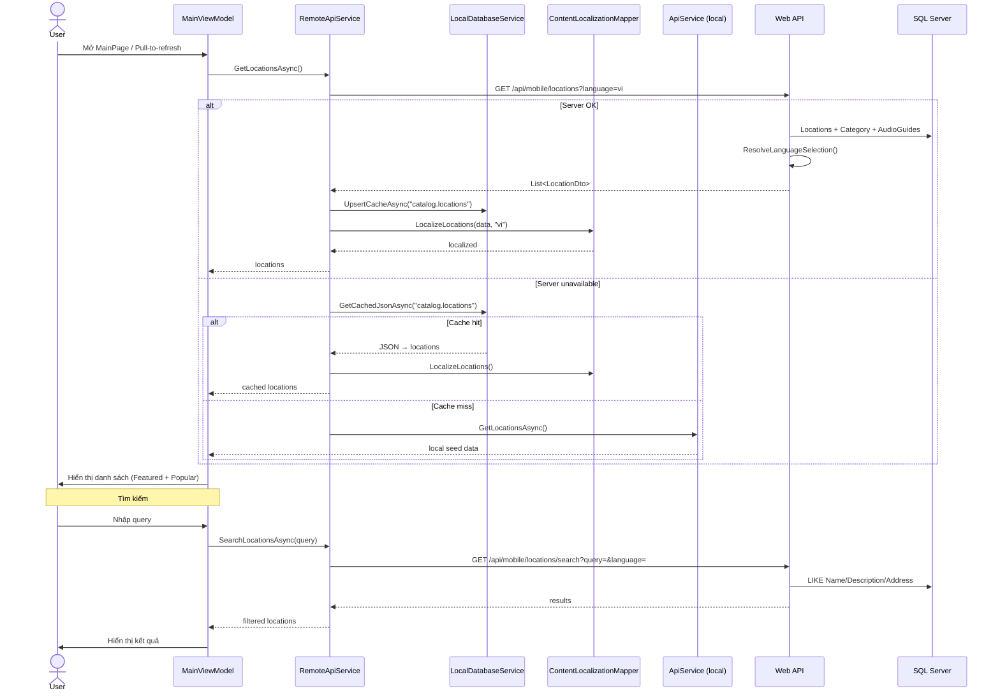

---

## 4. Auto-Playback System (TH1 → TH4)

Service mới `AutoPlaybackService` xử lý 4 tình huống phức tạp dựa trên scoring system.

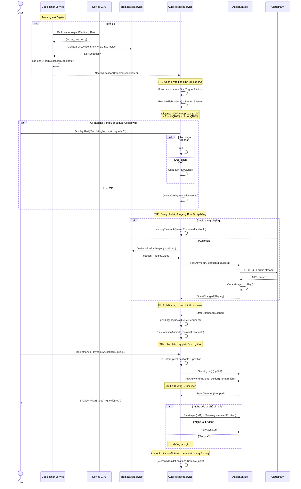

---

## 5. Phát Audio Guide (Manual)

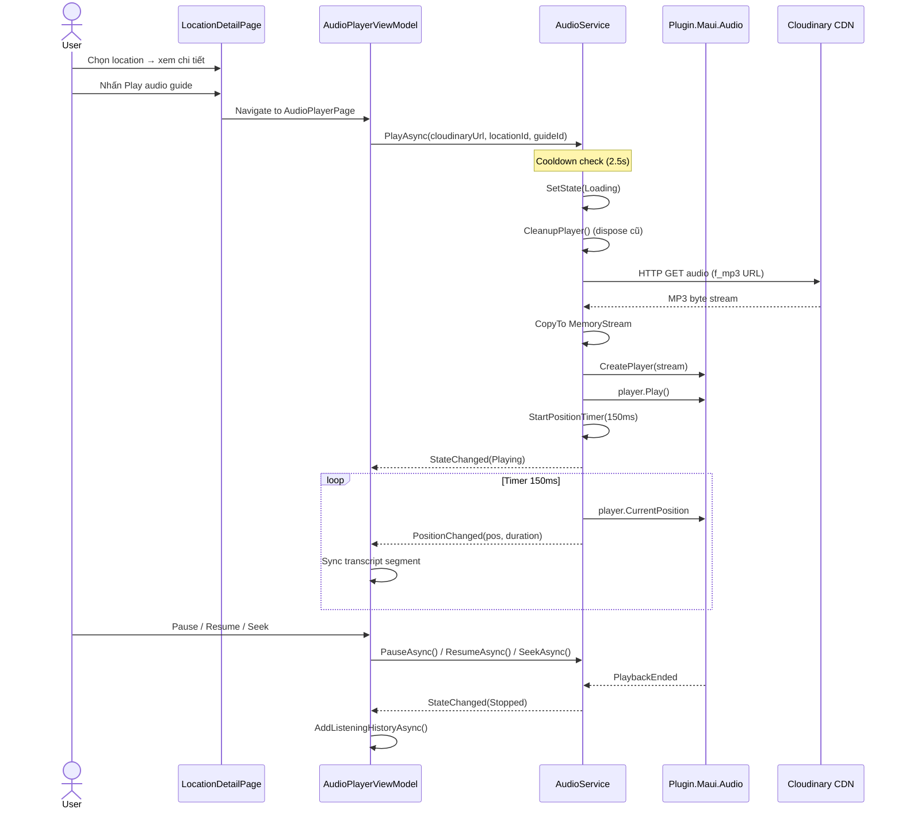

---

## 6. Heartbeat & Session Keep-alive

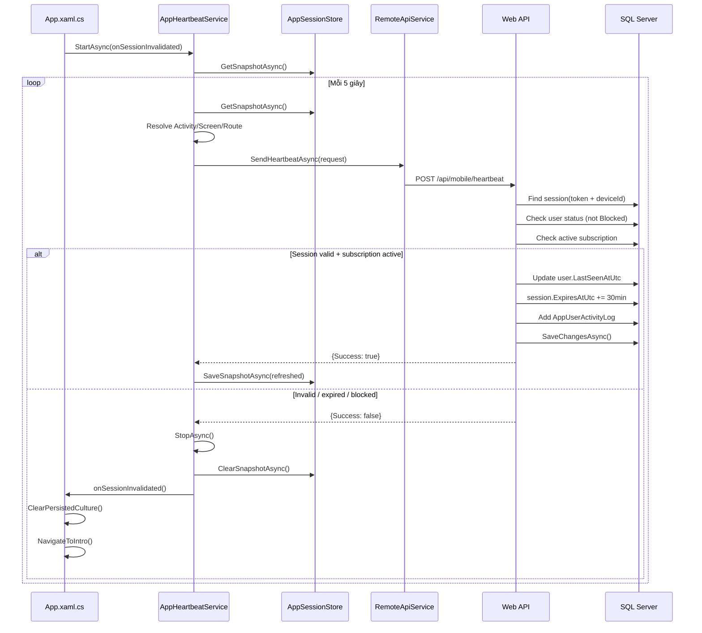

---

## 7. Đăng nhập Web Admin (Cookie Auth)

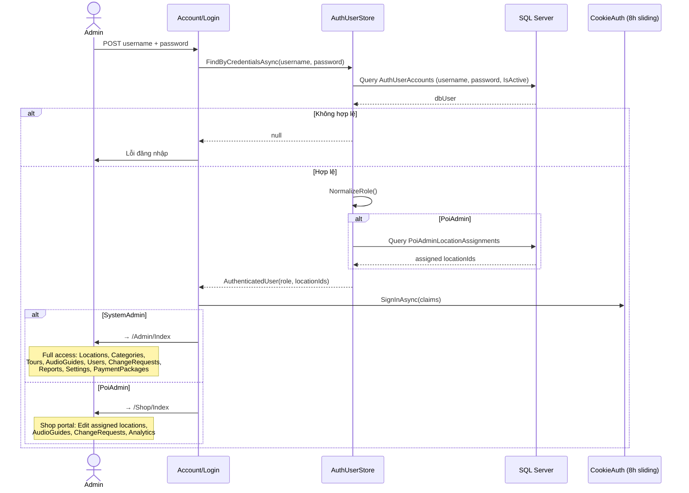

---

## 8. POI Change Request Workflow (với TTS on Approval)

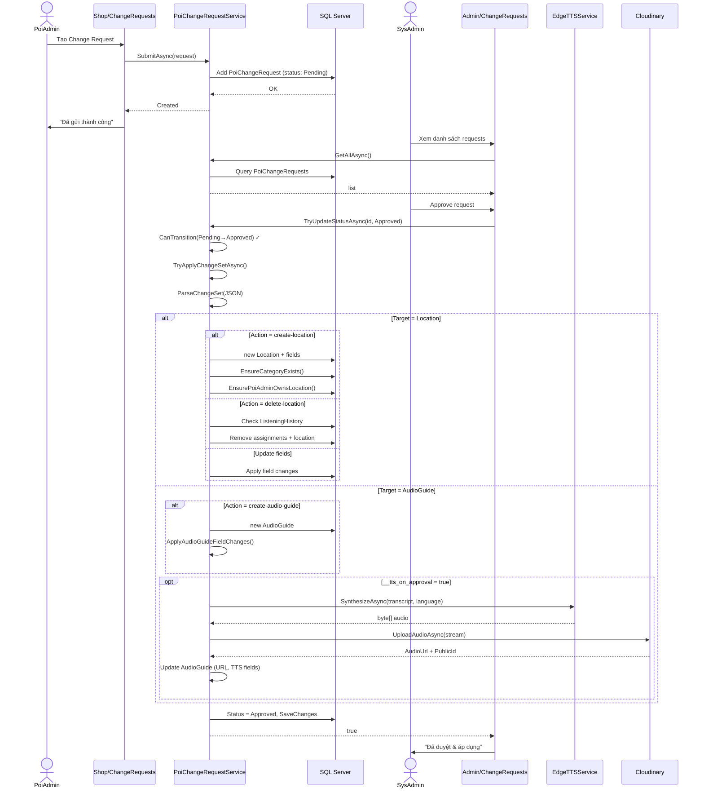

---

## 9. TTS Generation (Edge + Google Fallback)

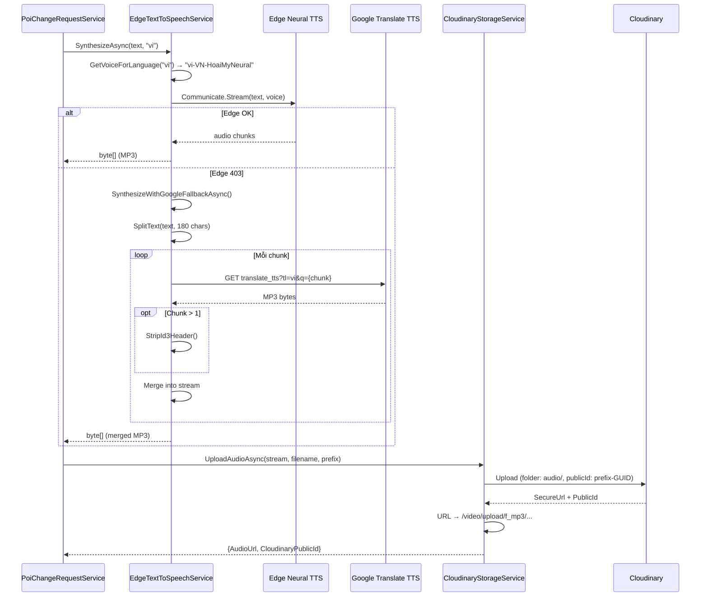

---

## 10. Payment Package Management (Admin CRUD)

Service mới `PaymentPackageService` cho SystemAdmin quản lý gói thanh toán.

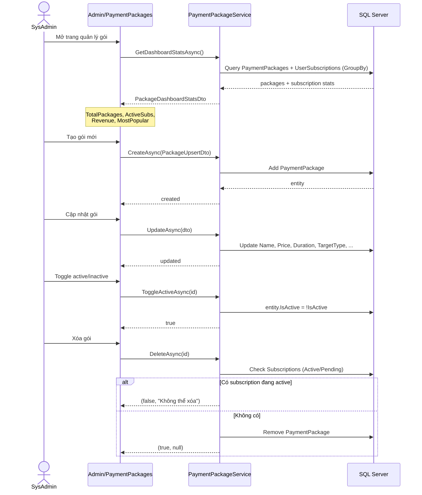

---

## 11. Expired Account Cleanup (Background Service)

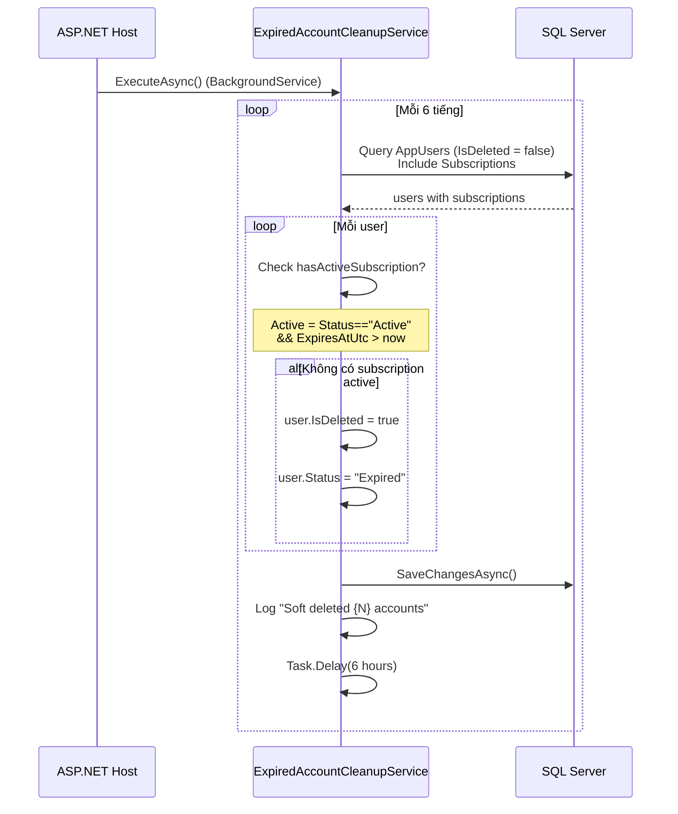

---

## Tổng quan Kiến trúc Hệ thống

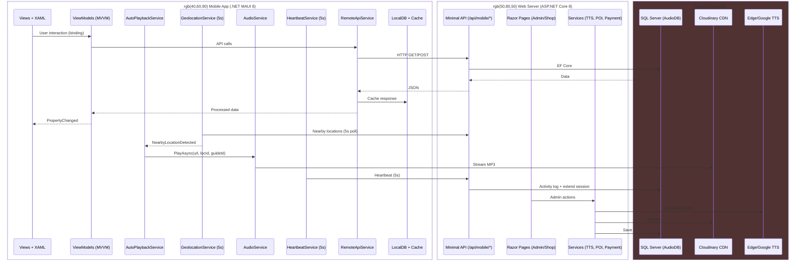
