# VinhKhanhAudioGuide - Mobile Sequence Diagrams

Tài liệu này định nghĩa 15 Sequence Diagram chuyên biệt cho từng chức năng trên thiết bị di động (Mobile App).

## 1. Phát thuyết minh audio tự động theo vị trí (Auto-Playback)
Quy trình gọi tự động kích hoạt audio khi đã xác định được điểm phù hợp từ hàng đợi.

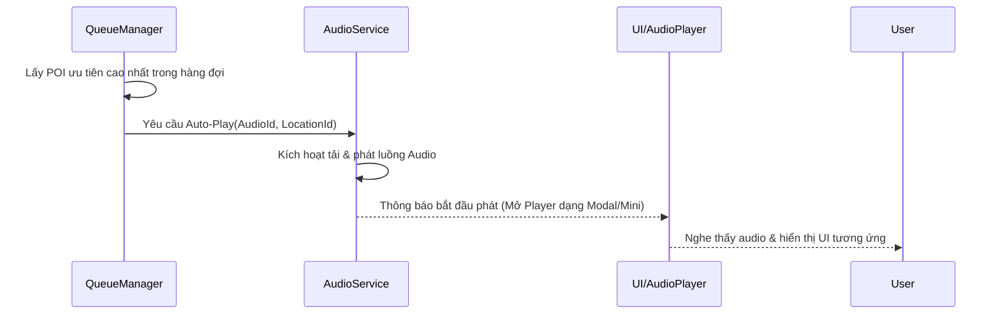

## 2. Trình phát audio (Audio Player)
Giao tiếp giữa người dùng và bộ điều khiển Audio (Play, Pause, Seek).

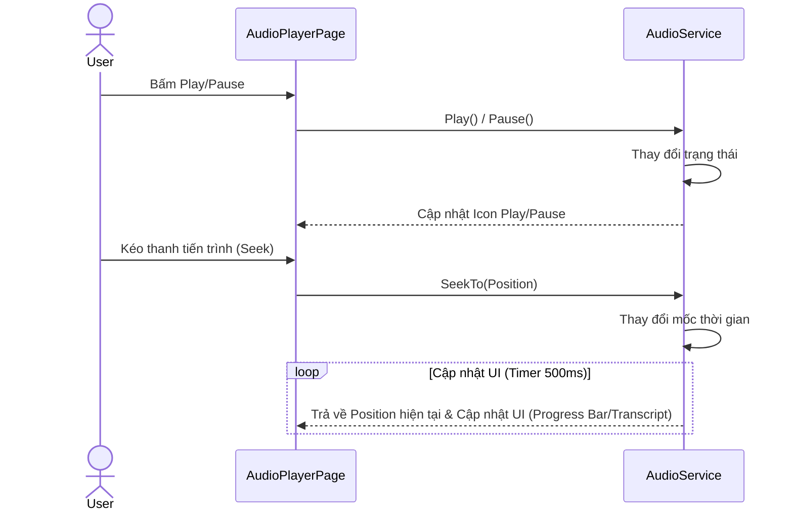

## 3. Quản lý lịch sử nghe
Ghi nhận quá trình nghe của người dùng sau khi hoàn tất hoặc dừng audio.

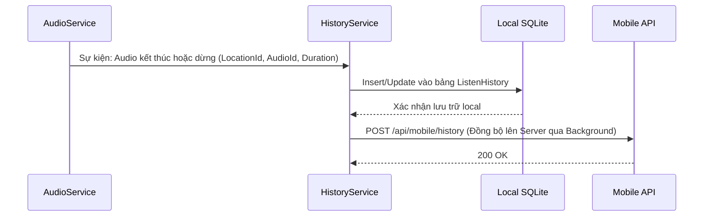

## 4. Xem chi tiết điểm tham quan (POI)
Kiểm tra dữ liệu local trước khi lấy dữ liệu qua mạng.

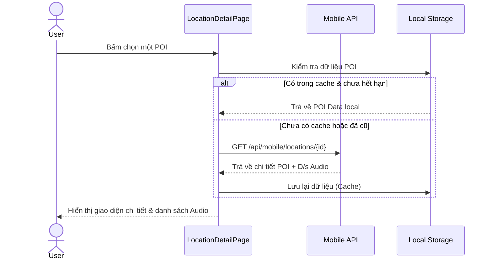

## 5. Định vị GPS & phát hiện điểm gần nhất
Theo dõi vị trí thiết bị và lấy dữ liệu các POI nằm trong bán kính cho phép.

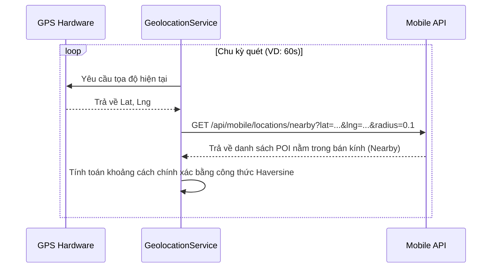

## 6. Quản lý hàng đợi
Đẩy các POI nhận được từ tính năng định vị vào một hàng chờ để xử lý tuần tự.

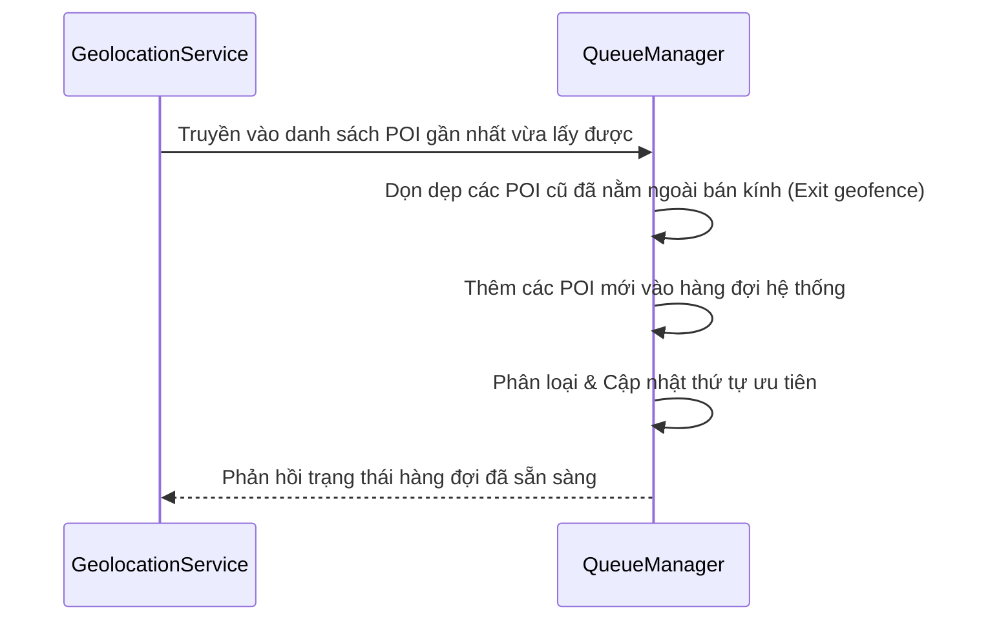

## 7. Xử lý trùng (chia rõ các trường hợp)
Các lớp bảo vệ nhằm tránh việc spam phát audio hoặc lặp lại cùng một địa điểm liên tục.

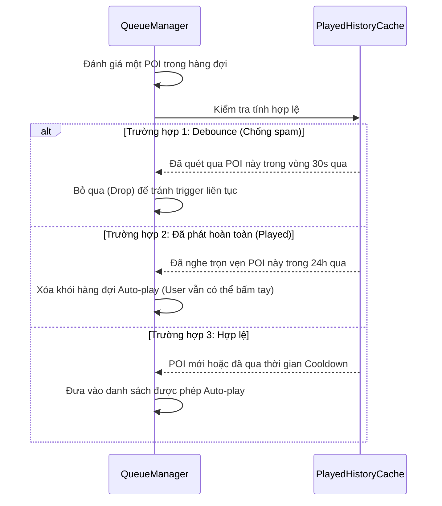

## 8. Ưu tiên POI theo scoring
Thuật toán tính điểm (Scoring) để chọn ra POI nào sẽ được phát audio trước khi có nhiều điểm ở gần nhau.

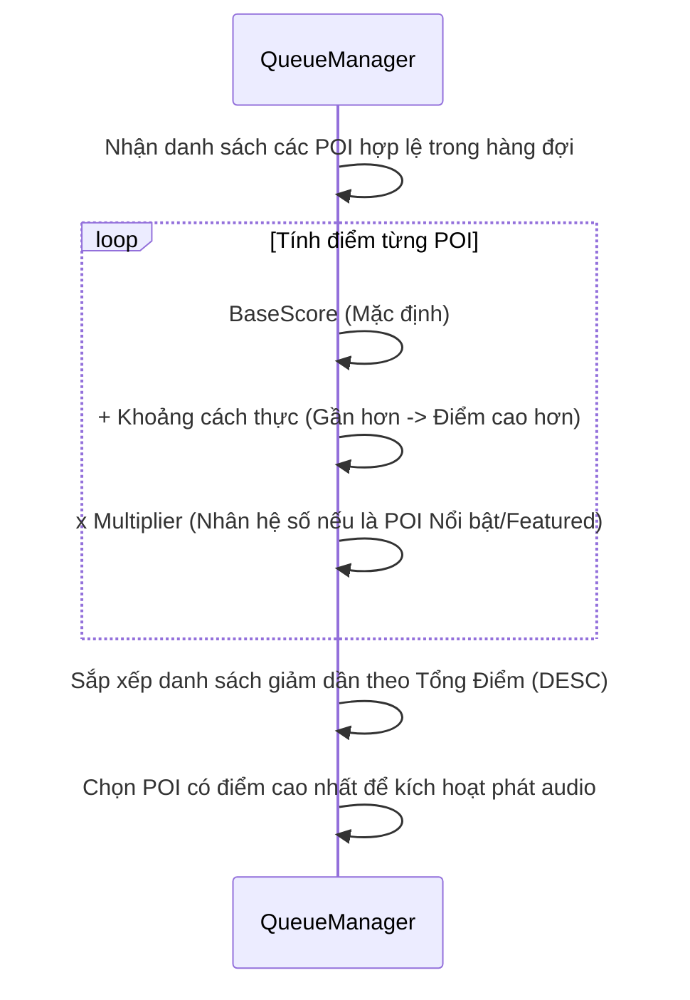

## 9. Tìm kiếm địa điểm & tour (Search)
Tìm kiếm tức thời (với Debounce) để giảm tải request.

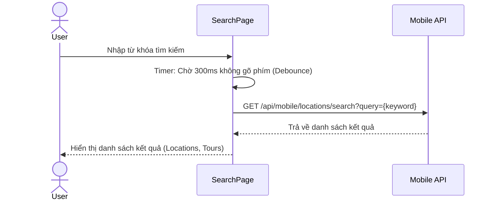

## 10. Xem chi tiết tour
Hiển thị mô tả và lộ trình các điểm dừng.

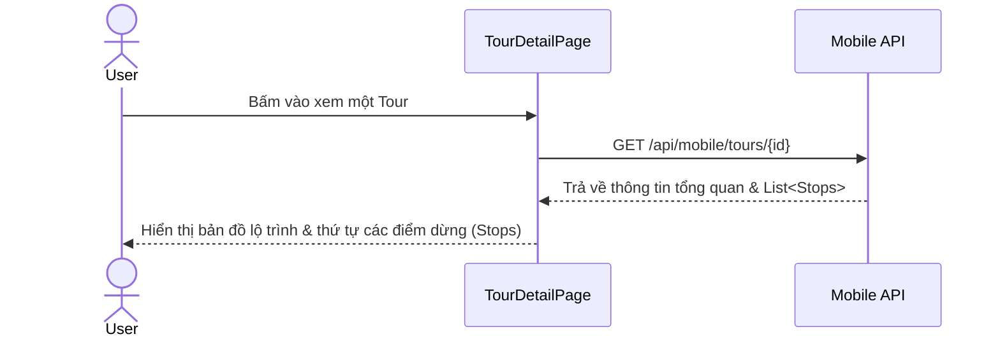

## 11. Quản lý tiến trình tour
Lưu trạng thái và giúp người dùng tiếp tục tour từ điểm đến hiện tại.

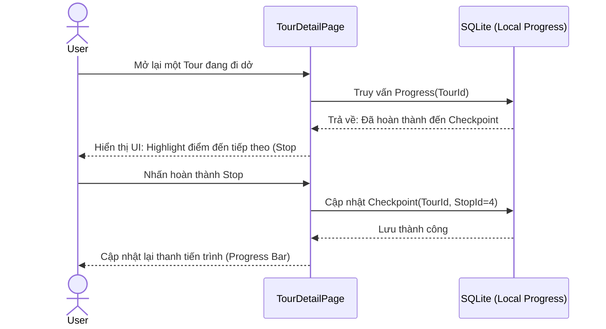

## 12. Quét QR, thanh toán
Hai luồng vào duy nhất để lấy được quyền truy cập app.

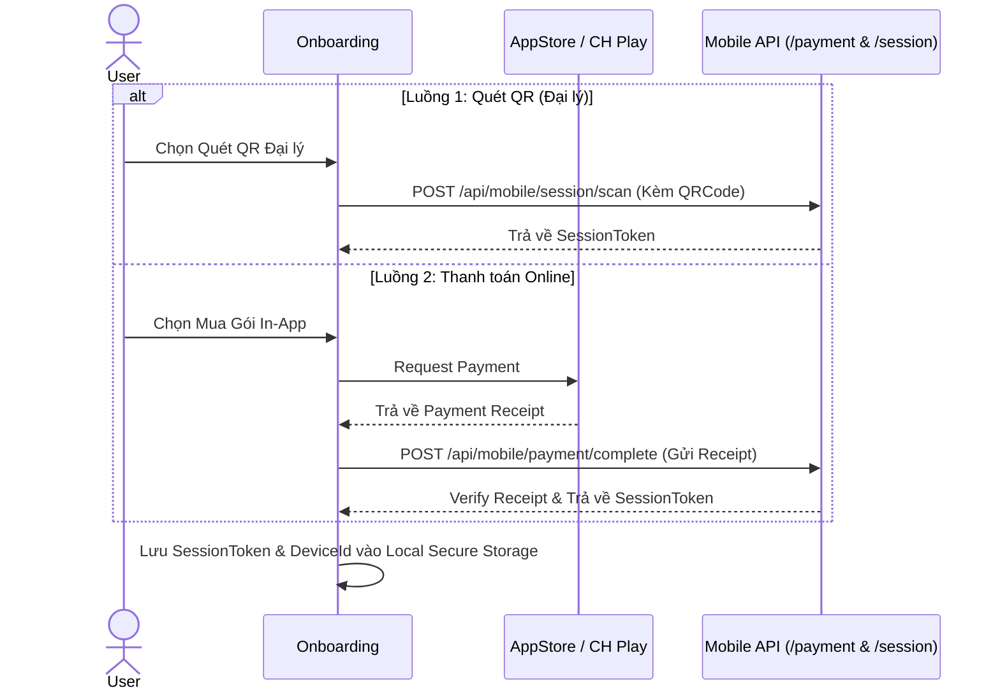

## 13. Quản lý session thiết bị (lưu/kiểm tra token)
Cơ chế kiểm tra quyền truy cập mỗi khi app khởi động.

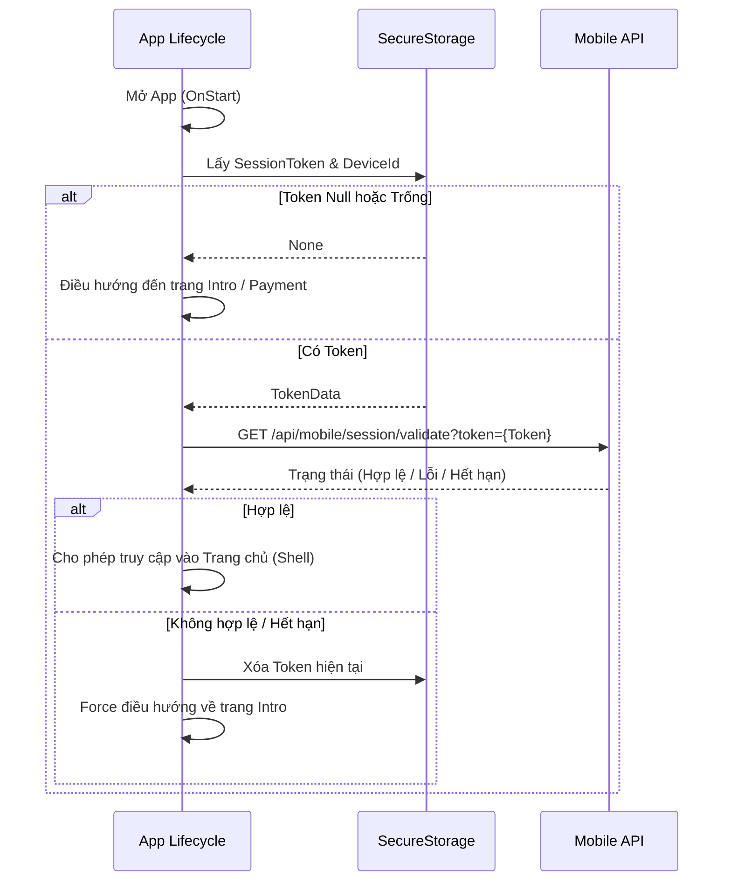

## 14. Heartbeat định kỳ (duy trì session)
Cập nhật trạng thái 'đang hoạt động' của người dùng lên server và thu hồi quyền ngay khi hết hạn.

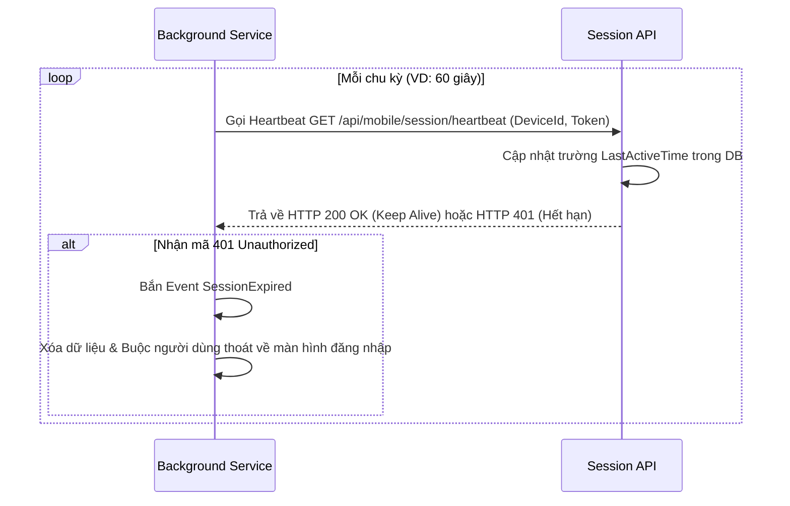

## 15. Đa ngôn ngữ (i18n)
Dịch thuật giao diện ngay lập tức khi người dùng thay đổi tùy chọn ngôn ngữ.

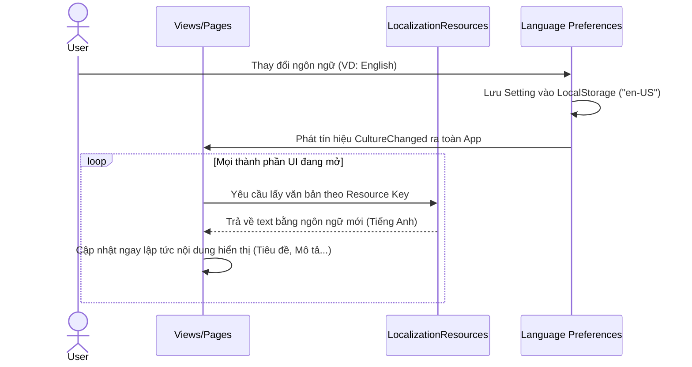
