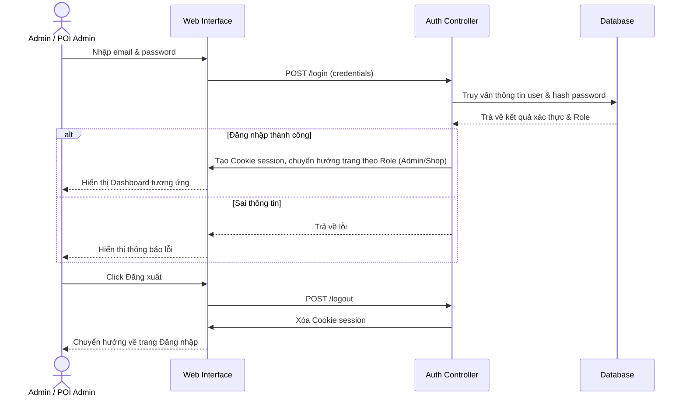
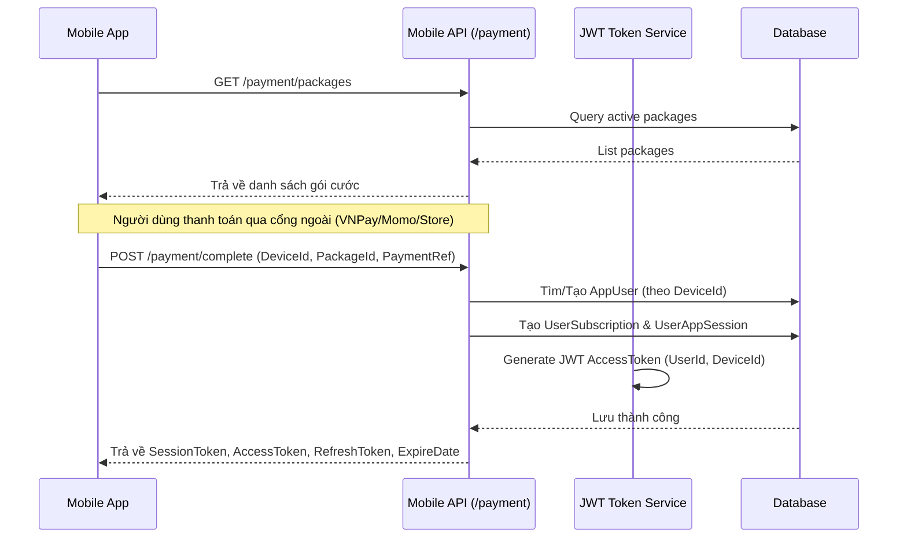
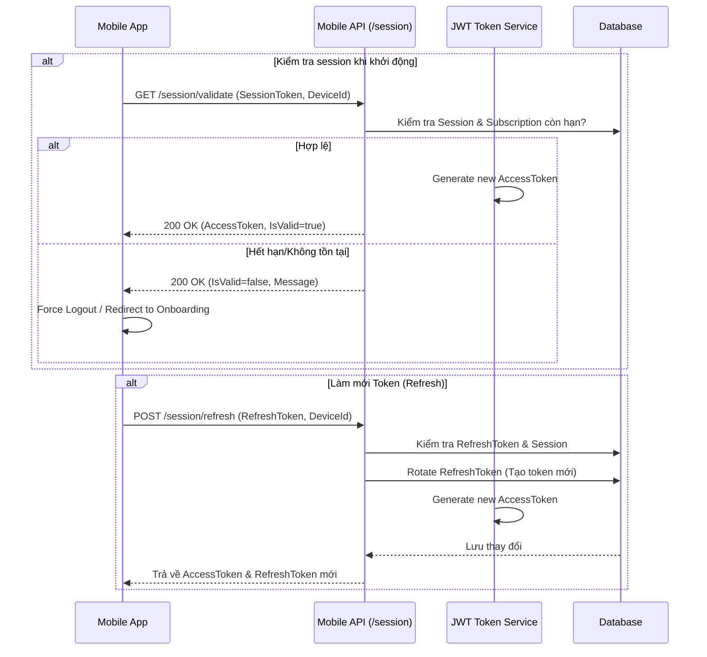
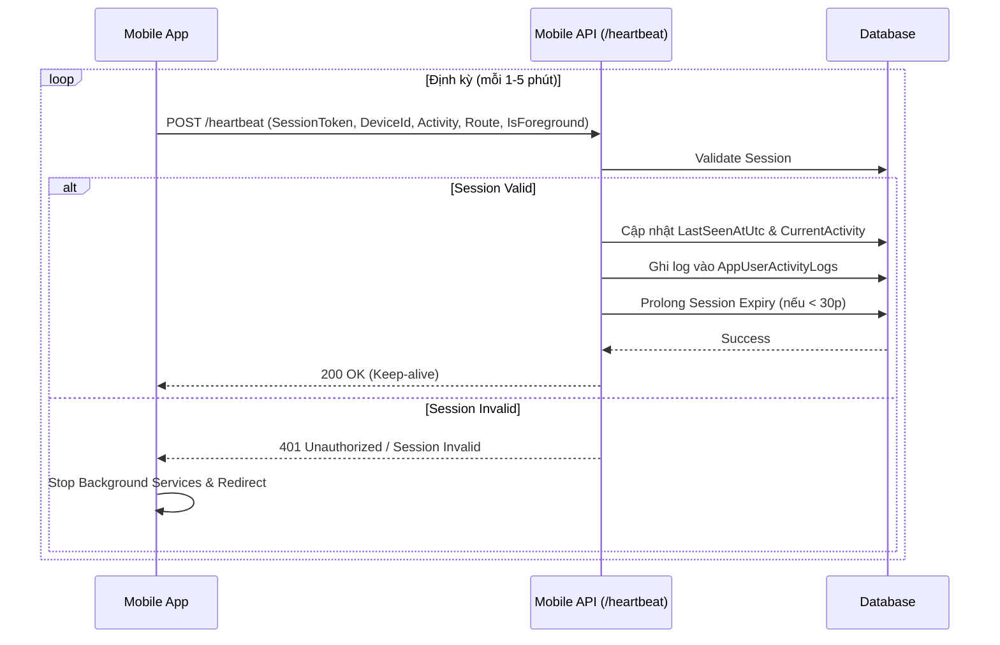
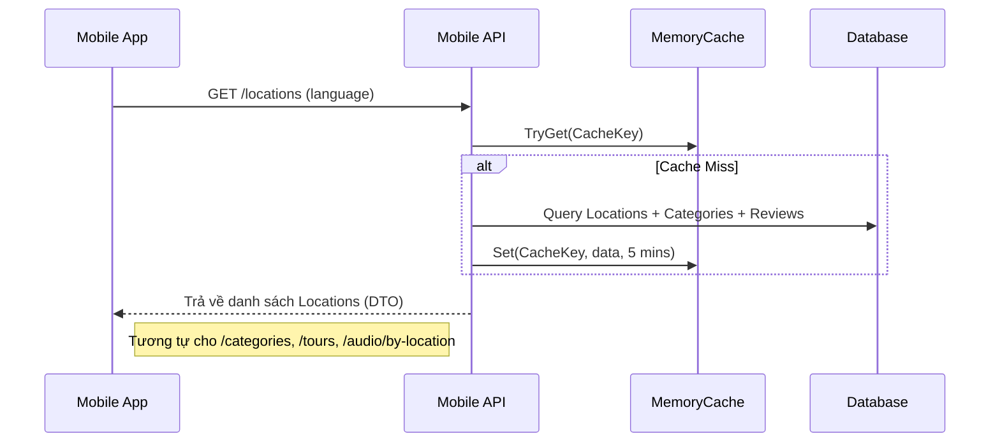
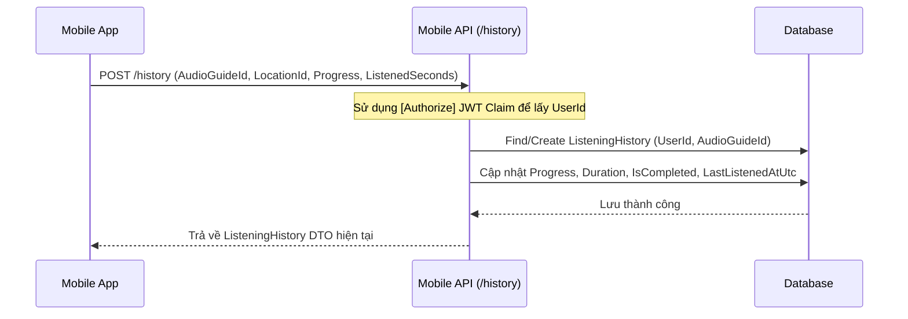
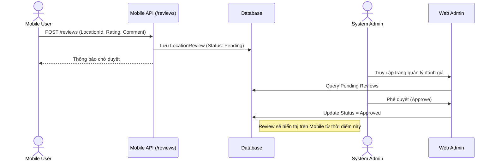
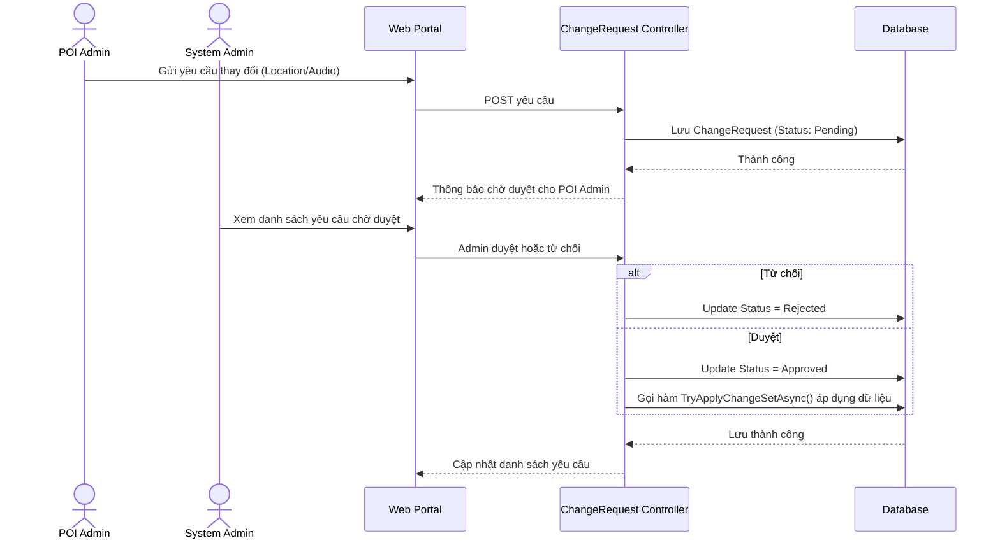
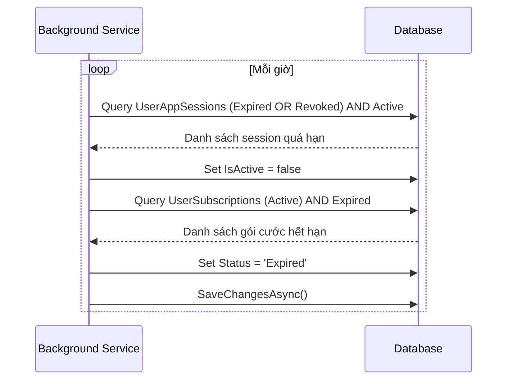
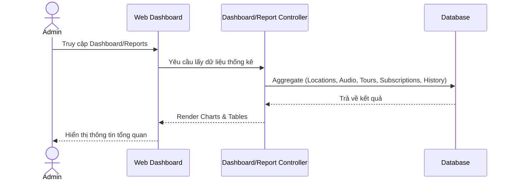

# VinhKhanhAudioGuide - System Sequence Diagrams

Dưới đây là các Sequence Diagram (Biểu đồ tuần tự) cập nhật theo kiến trúc và chức năng hiện tại của dự án AudioLife (VinhKhanhAudioGuide).

## 1. Authentication (Web Admin)
Xử lý đăng nhập phân quyền cho System Admin và POI Admin trên giao diện Web.

## 2. Mobile Onboarding & Payment (Kích hoạt thiết bị)
Quy trình từ lúc Mobile app quét QR/chọn gói đến khi nhận được JWT Access Token.

## 3. Session Validation & Refresh (Mobile)
Kiểm tra và làm mới phiên làm việc của thiết bị di động.

## 4. Heartbeat & Activity Logging (Mobile)
Duy trì session và ghi nhận hoạt động người dùng theo thời gian thực.

## 5. Catalog Management (Locations, Tours, Audio)
Luồng lấy dữ liệu danh mục cho Mobile App với cơ chế Cache.

## 6. Listening History (Lịch sử nghe)
Ghi nhận tiến trình nghe audio của người dùng.

## 7. Location Reviews (Đánh giá địa điểm)
Người dùng gửi đánh giá và Admin kiểm duyệt.

## 8. Text-to-Speech (TTS) Workflow
Tự động sinh audio từ văn bản (Hỗ trợ nhiều ngôn ngữ, fallback giữa Edge TTS và Google TTS).

## 9. Quy trình Change Request (POI Admin)
Luồng duyệt yêu cầu thay đổi từ phía POI Admin lên System Admin.

## 10. Background Session & Subscription Cleanup
Tự động dọn dẹp các session và gói cước hết hạn (SessionCleanupBackgroundService).

## 11. Dashboard & Reports (Web Admin)
Thống kê số liệu hệ thống dành cho Admin.

