# VinhKhanhAudioGuide - System Sequence Diagrams

Dưới đây là các Sequence Diagram (Biểu đồ tuần tự) mô tả luồng hoạt động của các chức năng trong hệ thống VinhKhanhAudioGuide dựa trên kiến trúc và yêu cầu hiện tại.

## 1. Authentication (Đăng nhập/Đăng xuất)
Xử lý đăng nhập phân quyền cho Admin và POI Admin.

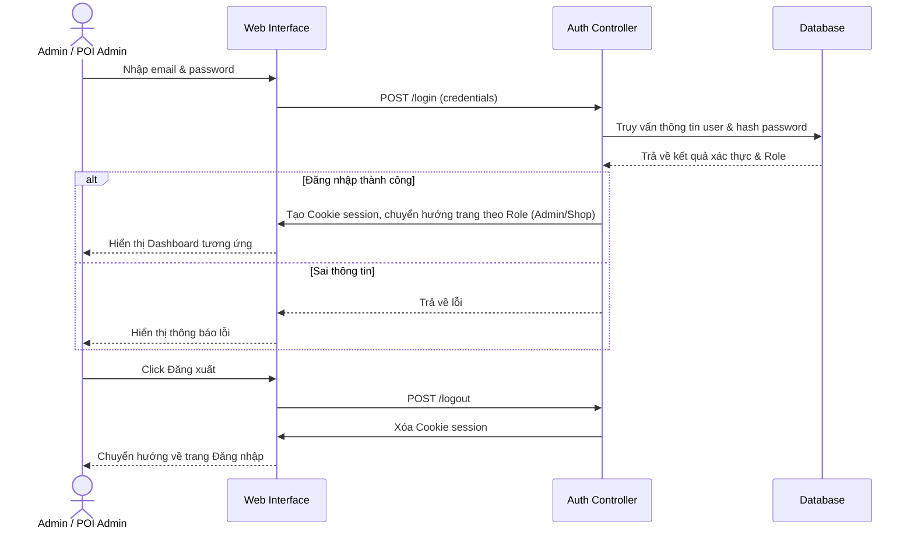

## 2. Dashboard Admin
Thống kê tổng quan số liệu hệ thống.

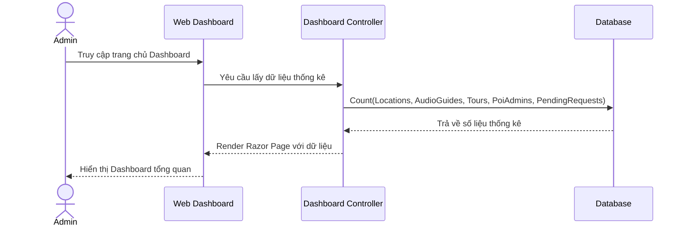

## 3. Quản lý địa điểm (Locations)
Thêm/sửa/xóa địa điểm, cập nhật tọa độ, hình ảnh, cấu hình bán kính phát hiện (Geofencing).

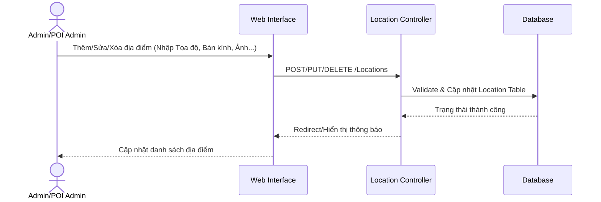

## 4. Quản lý Audio Guide
Thêm/sửa/xóa nội dung audio, upload file trực tiếp, quản lý transcript và tùy chọn ngôn ngữ.

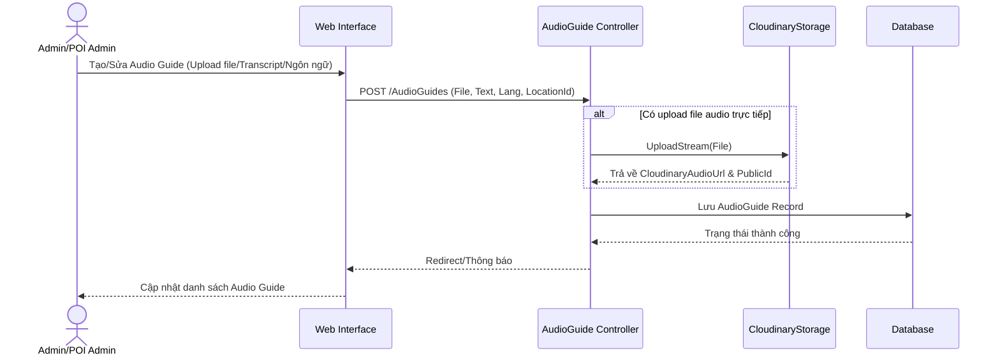

## 5. Quản lý danh mục (Categories)
Thao tác CRUD danh mục dành cho các địa điểm.

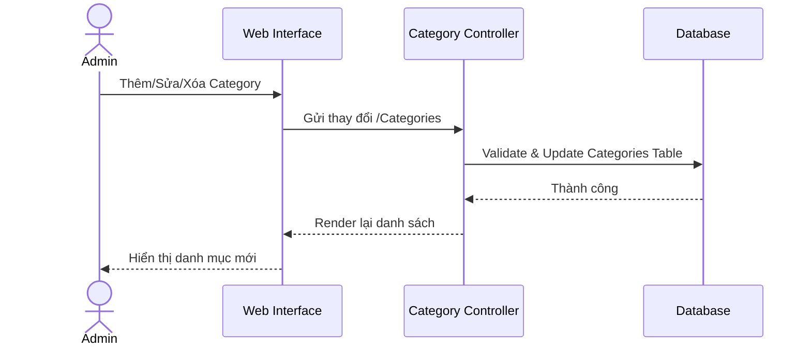

## 6. Quản lý Tour
Tạo, chỉnh sửa tour và sắp xếp các điểm dừng (stops).

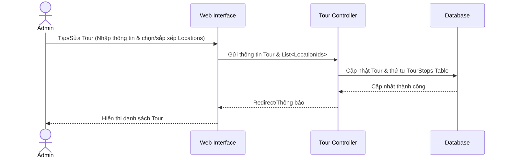

## 7. Text-to-Speech (TTS)
Tự động sinh audio từ văn bản (Hỗ trợ nhiều ngôn ngữ, fallback giữa Edge TTS và Google TTS).

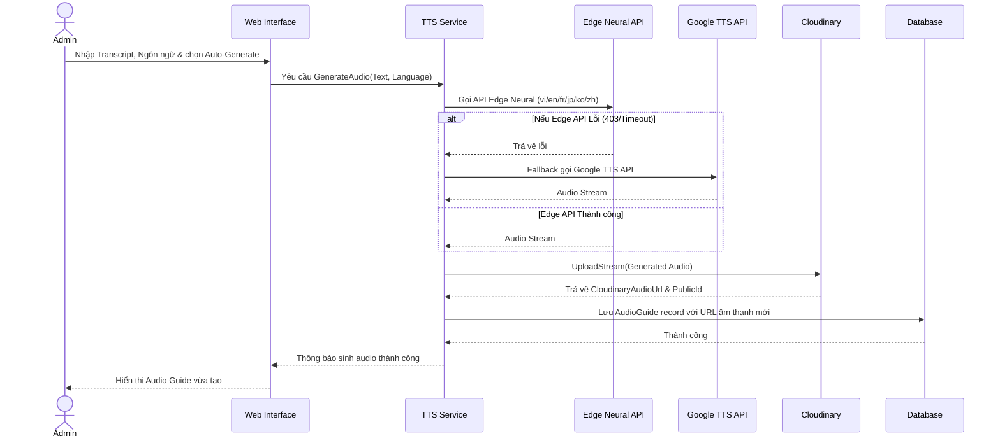

## 8. Upload audio lên Cloudinary
Tích hợp dịch vụ lưu trữ file audio độc lập trên Cloudinary.

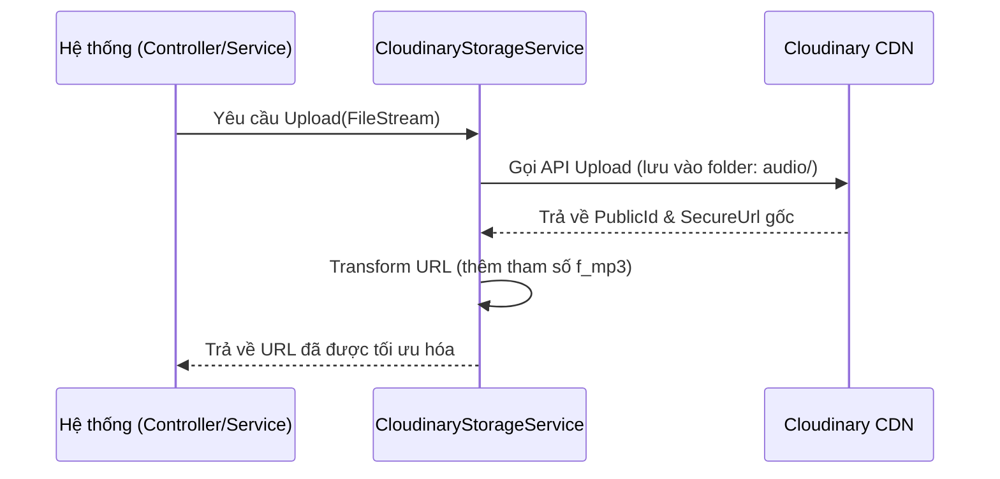

## 9. Quy trình Change Request (POI Admin)
Luồng duyệt yêu cầu thay đổi từ phía POI Admin lên System Admin.

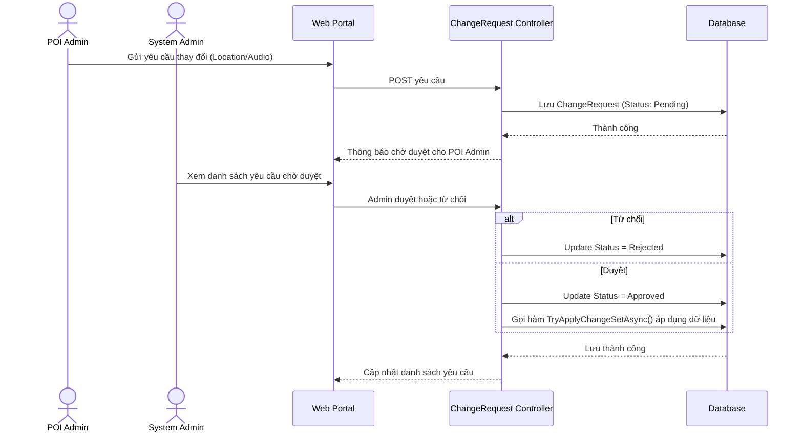

## 10. Quản lý tài khoản POI (System Admin)
Xem, khóa, mở khóa người dùng và phân quyền quản lý POI.

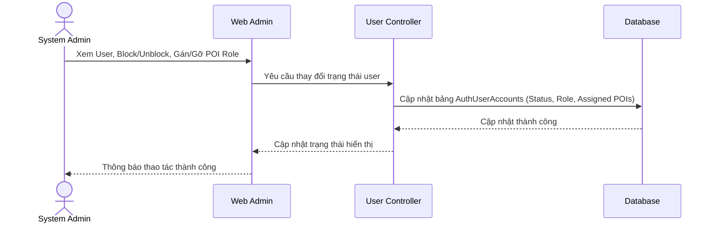

## 11. Quản lý gói thanh toán
Thêm, sửa, xóa, quản lý trạng thái các gói dịch vụ và thống kê Subscription.

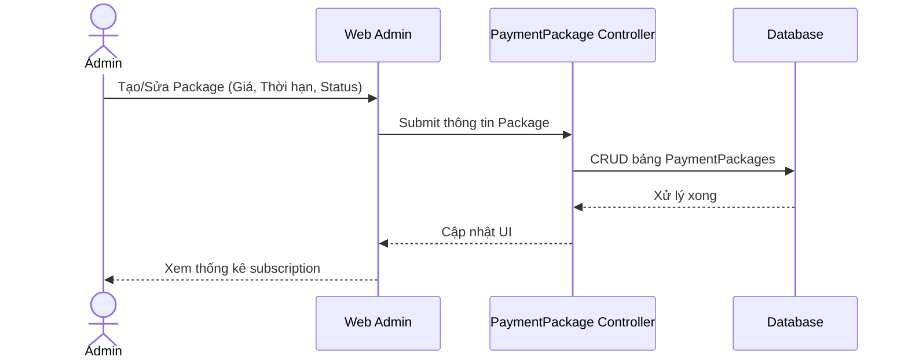

## 12. Báo cáo & Thống kê (Reports)
Tổng số lượng thực thể, phân bổ và top địa điểm phổ biến.

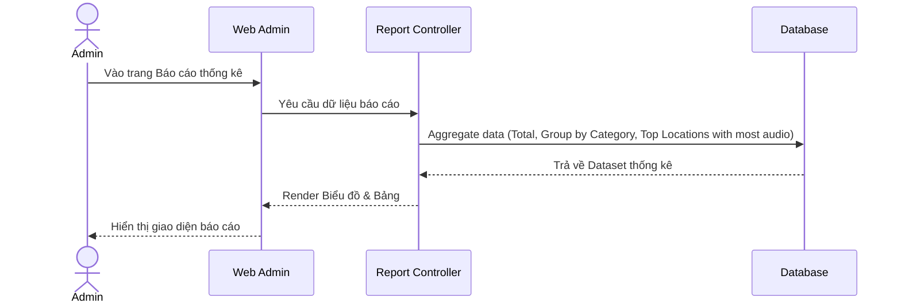

## 13. Lịch sử sử dụng (Usage History)
Ghi nhận và hiển thị lịch sử hoạt động của người dùng hệ thống/thiết bị.

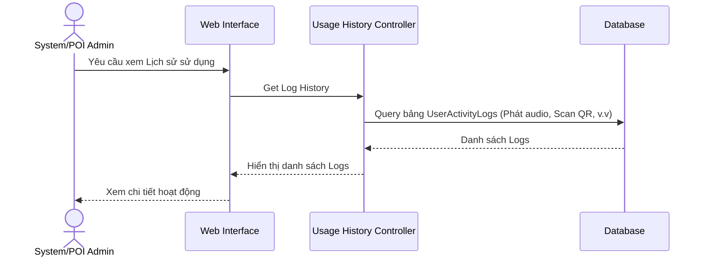

## 14. API phục vụ Mobile
REST API cung cấp dữ liệu cho thiết bị di động.

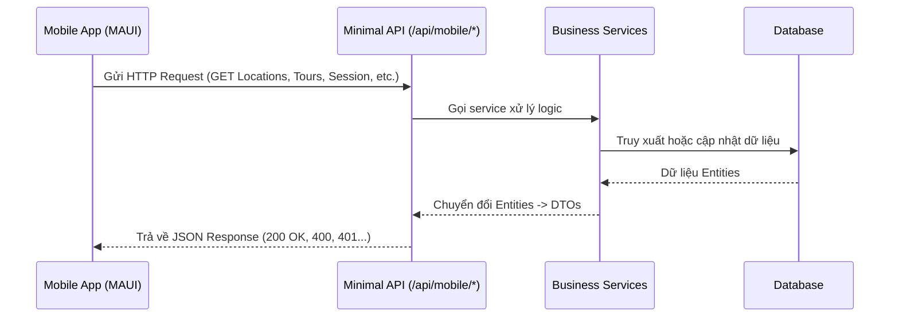

## 15. Session & Heartbeat Management
Xác thực session, gửi heartbeat duy trì kết nối và ghi log hoạt động của thiết bị.

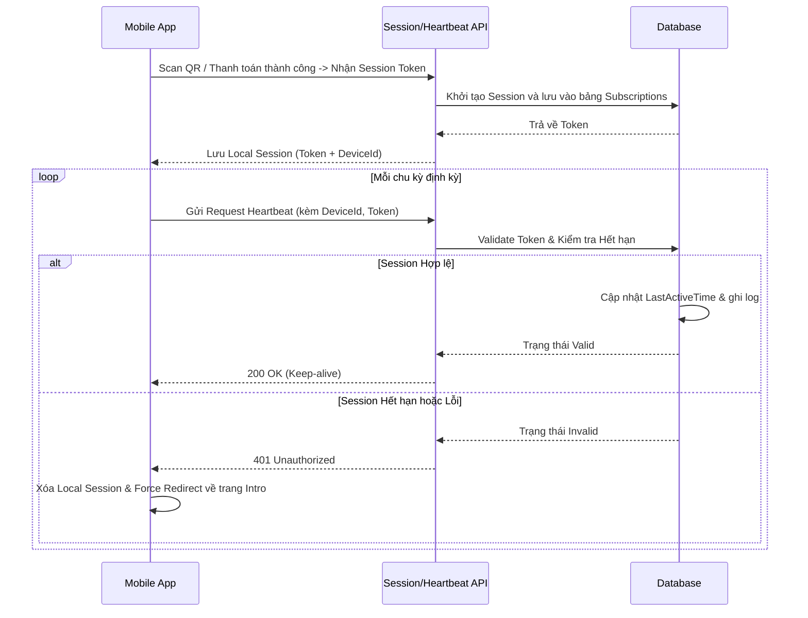

## 16. Dọn dẹp tài khoản hết hạn
Background job tự động dọn dẹp các session/tài khoản quá hạn sử dụng.

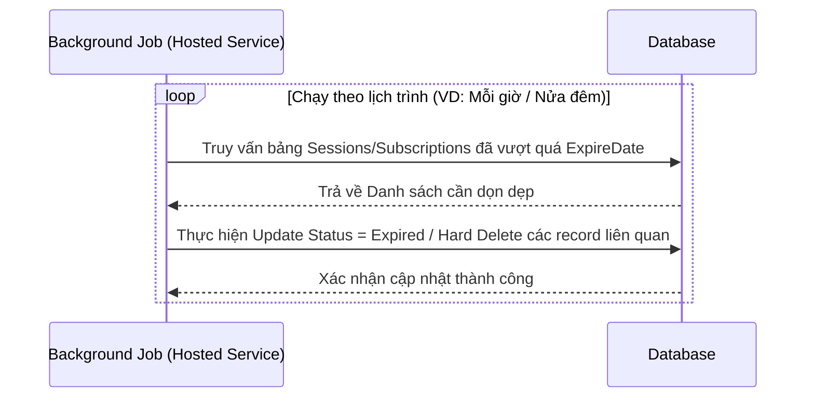
